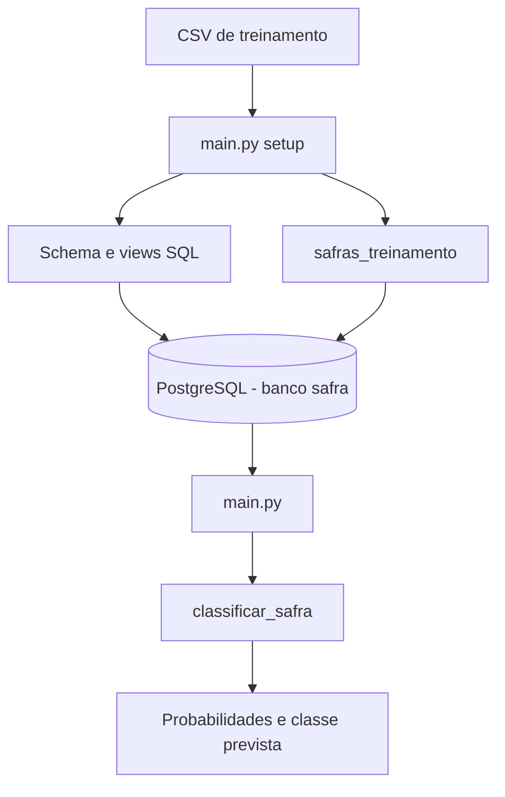
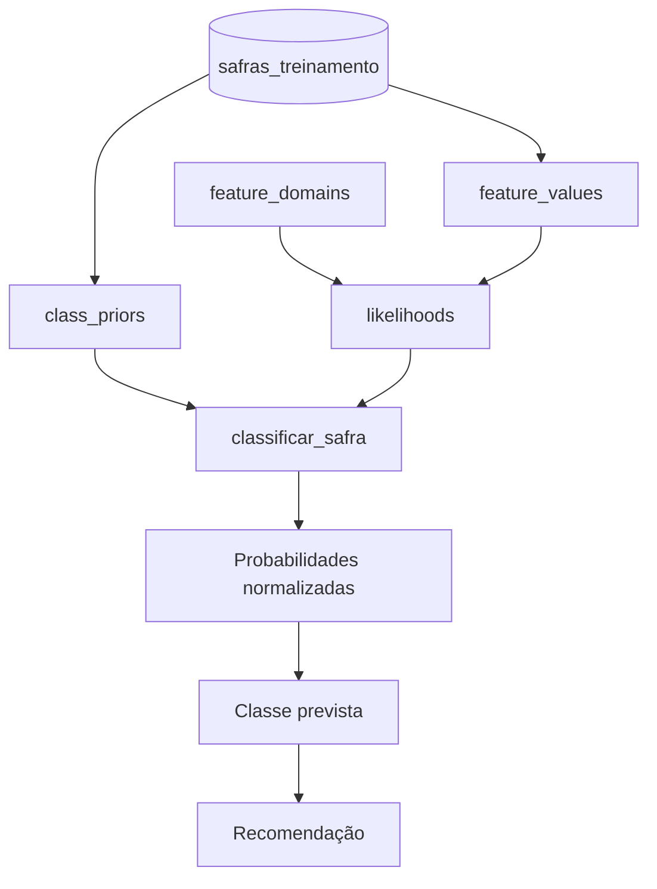
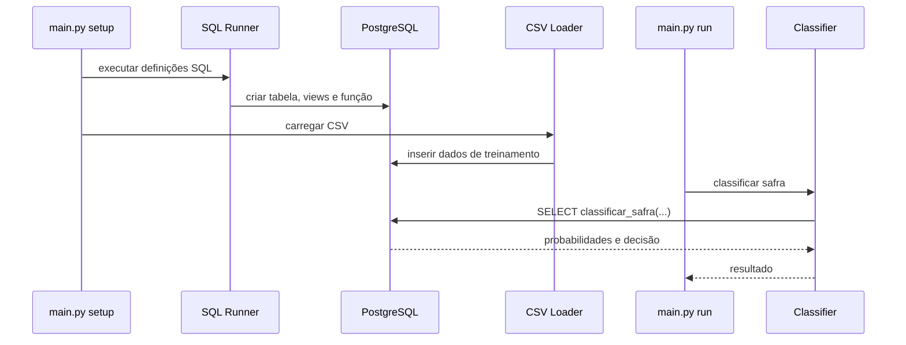

# Naive Bayes para Rentabilidade de Safras

Projeto acadêmico que implementa um classificador **Naive Bayes categórico em PostgreSQL** para prever se uma safra será economicamente rentável.

O Python é utilizado apenas para:

- conectar ao PostgreSQL;
- criar os objetos SQL do projeto;
- carregar o conjunto de treinamento em CSV;
- executar a função de classificação.

O cálculo do Naive Bayes é realizado diretamente no banco de dados.

---

## Objetivo

Classificar uma safra em uma das seguintes classes:

- `Sim` — safra economicamente rentável;
- `Nao` — safra não rentável.

O modelo utiliza as seguintes features categóricas:

- produtividade estimada;
- preço esperado de venda;
- custo total de produção por hectare;
- precipitação acumulada;
- temperatura média;
- incidência de pragas e doenças;
- custo dos insumos agrícolas;
- histórico de produtividade da área.

---

## Funcionamento

O fluxo geral do projeto é:



O banco calcula:

1. probabilidades a priori `P(classe)`;
2. verossimilhanças `P(feature = valor | classe)`;
3. suavização de Laplace;
4. scores utilizando log-probabilidades;
5. normalização dos scores entre `0%` e `100%`;
6. classe prevista e recomendação.

---

## Estrutura do projeto

```text
.
├── data/
│   └── dados_safra_rentabilidade.csv
│
├── sql/
│   ├── tables/
│   │   └── safras_treinamento.sql
│   │
│   ├── views/
│   │   ├── dominios_features.sql
│   │   ├── valores_features.sql
│   │   ├── probabilidades_priori.sql
│   │   └── verossimilhancas.sql
│   │
│   └── functions/
│       └── classificar_safra.sql
│
├── docs/
│   ├── training-data-model.md
│   ├── naive-bayes-training.md
│   └── naive-bayes-inference.md
│
├── src/
│   ├── __init__.py
│   ├── config.py
│   ├── database.py
│   ├── csv_loader.py
│   ├── sql_runner.py
│   └── classifier.py
│
├── main.py
├── requirements.txt
└── README.md
```

---

## Arquitetura SQL



### Responsabilidade dos objetos

| Objeto | Responsabilidade |
|---|---|
| `safras_treinamento` | armazena os registros de treinamento |
| `feature_domains` | define as categorias possíveis de cada feature |
| `feature_values` | transforma os registros em pares feature/valor |
| `class_priors` | calcula `P(classe)` |
| `likelihoods` | calcula `P(feature = valor | classe)` com Laplace |
| `classificar_safra()` | calcula os scores, normaliza e retorna a classificação |

---

## Pré-requisitos

É necessário possuir:

- Python 3;
- PostgreSQL;
- banco PostgreSQL chamado `safra`;
- `pip`.

O banco `safra` deve existir antes da execução do projeto.

---

## Instalação

Clone ou acesse o diretório do projeto e crie um ambiente virtual:

```bash
python -m venv .venv
```

### Linux/macOS

```bash
source .venv/bin/activate
```

### Windows PowerShell

```powershell
.\.venv\Scripts\Activate.ps1
```

Instale as dependências:

```bash
pip install -r requirements.txt
```

O `requirements.txt` utiliza:

```text
psycopg[binary]
python-dotenv
```

---

## Configuração do PostgreSQL

Por padrão, o projeto utiliza:

```text
host: localhost
port: 5432
database: postgres
user: postgres
password: postgres
```

Para usar o banco `safra`, defina `DB_NAME=safra`. Esses valores podem ser
alterados através de variáveis de ambiente.

### Linux/macOS

```bash
export DB_HOST=localhost
export DB_PORT=5432
export DB_NAME=safra
export DB_USER=postgres
export DB_PASSWORD=sua_senha
```

### Windows PowerShell

```powershell
$env:DB_HOST="localhost"
$env:DB_PORT="5432"
$env:DB_NAME="safra"
$env:DB_USER="postgres"
$env:DB_PASSWORD="sua_senha"
```

A configuração é lida em:

```text
src/config.py
```

---

## Dataset

O arquivo utilizado para treinamento deve estar em:

```text
data/dados_safra_rentabilidade.csv
```

O CSV deve possuir as colunas:

```text
Nome da safra
Produtividade estimada
Preço esperado de venda
Custo total de produção por hectare
Precipitação acumulada
Temperatura média
Incidência de pragas e doenças
Custo dos insumos agrícolas
Histórico de produtividade da área
Rentavel
```

`Nome da safra` é somente um identificador sintético e nunca participa do cálculo do Naive Bayes. Como o conjunto original não informa a cultura de cada linha, os 120 registros usam o ciclo `Soja`, `Milho`, `Algodão`, `Arroz`, `Feijão` e `Sorgo`: 20 registros por cultura, com 10 `Sim` e 10 `Nao`. Eles não representam um mapeamento agronômico de origem.

O campo `Rentavel` deve conter somente:

```text
Sim
Nao
```

---

## Como executar

Com o PostgreSQL em execução e o ambiente Python configurado:

```bash
scripts/setup.sh
scripts/run.sh
```

Os comandos Python são:

```bash
python main.py setup
python main.py run
python main.py test
python main.py clean
```

Sem argumento, `python main.py` equivale a `python main.py run`.

Os scripts `scripts/setup.sh`, `scripts/run.sh`, `scripts/test.sh` e `scripts/clean.sh` são atalhos para esses quatro comandos. `setup` cria ou atualiza o schema e carrega o CSV. Execute-o antes da primeira classificação e sempre que os dados de treinamento mudarem.

O fluxo executado é:



A saída será semelhante a:

```text
$ scripts/setup.sh
Configurando estrutura SQL...
Executado: safras_treinamento.sql
Executado: dominios_features.sql
Executado: valores_features.sql
Executado: probabilidades_priori.sql
Executado: verossimilhancas.sql
Executado: classificar_safra.sql

Carregando dados de treinamento...
120 registros importados com sucesso.

$ scripts/run.sh
Classificando safra...

Resultado
--------------------------------------------------
Rentável: 93.59%
Não rentável: 6.41%
Classe: Sim
Recomendação: Probabilidade muito alta de rentabilidade.
```

Os percentuais dependem dos dados armazenados na tabela de treinamento.

Para executar os oito cenários de teste:

```bash
scripts/test.sh
```

O resultado inclui `caso | nome_safra | ...`. `nome_safra` é somente o rótulo sintético do cenário exibido e não é enviado a `classificar_safra()` nem participa do modelo.

Os cenários 07 e 08 usam o mesmo perfil com nomes de safras diferentes. Eles
mostram uma limitação do modelo: como o nome não é uma feature, o classificador
produz a mesma saída para as duas culturas.

---

## Limpeza do banco

```bash
scripts/clean.sh
```

O script remove somente os objetos do projeto na ordem de dependências: a função `classificar_safra()`, as views atuais e legadas `nb_*` do Naive Bayes e, por último, a tabela `safras_treinamento` com todos os dados de treinamento. Não usa `CASCADE`; dependências externas continuam bloqueando a operação. Execute `scripts/setup.sh` depois para recriar e recarregar o banco.

---

## Classificação manual pelo PostgreSQL

Também é possível chamar o classificador diretamente por SQL:

```sql
SELECT *
FROM classificar_safra(
    'Alta',
    'Alto',
    'Médio',
    'Adequada',
    'Adequada',
    'Baixa',
    'Normal',
    'Alto'
);
```

A função retorna:

```text
probabilidade_sim
probabilidade_nao
classe_prevista
recomendacao
```

---

## Fluxo do Naive Bayes


A classificação utiliza:

```text
log_score(C) =
    ln(P(C))
    +
    Σ ln(P(Xi | C))
```

Depois, os scores são convertidos novamente para escala linear e normalizados para que:

```text
P(Sim) + P(Nao) = 100%
```

---

## Documentação técnica

A documentação detalhada dos objetos SQL está dividida por responsabilidade:

```text
docs/training-data-model.md
docs/naive-bayes-training.md
docs/naive-bayes-inference.md
```

Cada documento explica os objetos SQL e os cálculos realizados naquela etapa.

---

## Observações

- O algoritmo Naive Bayes é implementado em SQL.
- O Python não calcula as probabilidades do modelo.
- O Python atua como camada de execução e integração com o PostgreSQL.
- As features utilizadas são exclusivamente categóricas.
- A suavização de Laplace evita probabilidades condicionais iguais a zero.
- Log-probabilidades são utilizadas para reduzir o risco de underflow numérico.
- As probabilidades finais são normalizadas para valores percentuais.
