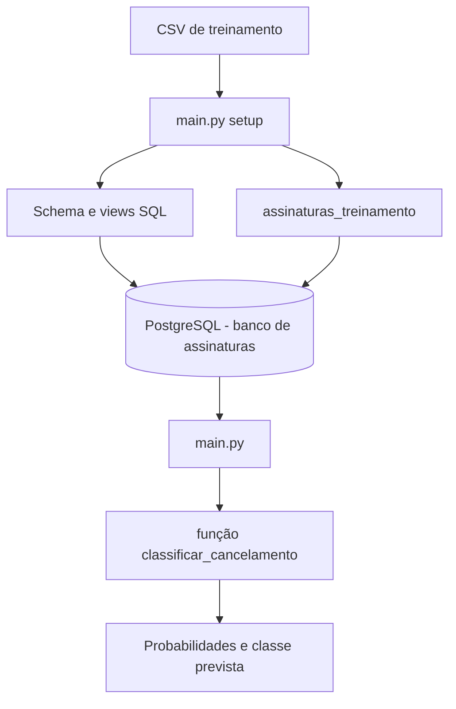
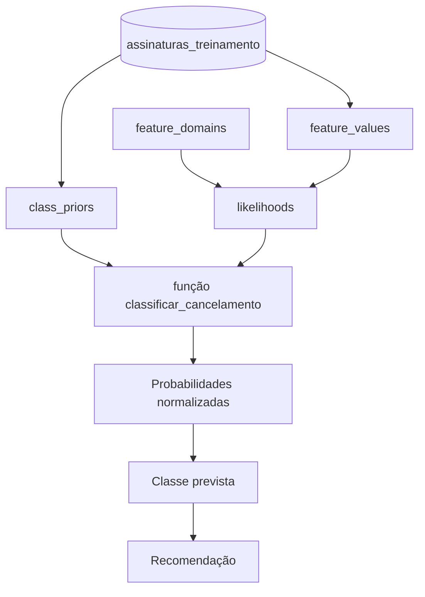
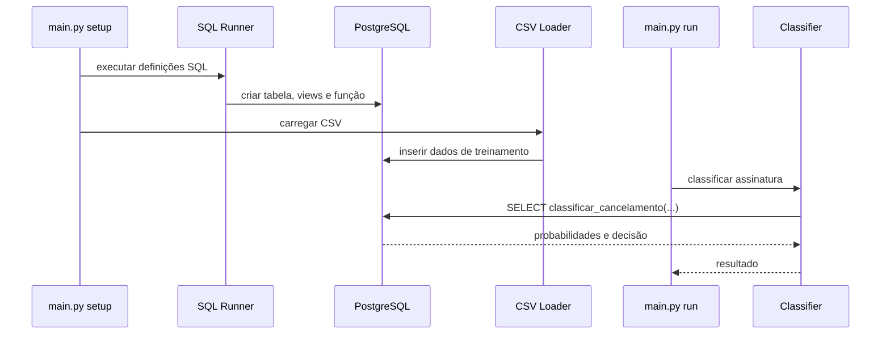
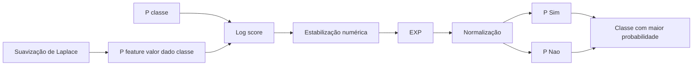

# Naive Bayes para Cancelamento de Assinaturas

Projeto acadêmico que implementa um classificador **Naive Bayes categórico em PostgreSQL** para prever se o cliente cancelará a assinatura dentro de 30 dias.

O Python é utilizado apenas para:

- conectar ao PostgreSQL;
- criar os objetos SQL do projeto;
- carregar o conjunto de treinamento em CSV;
- executar a função de classificação.

O cálculo do Naive Bayes é realizado diretamente no banco de dados.

---

## Objetivo

Classificar uma assinatura em uma das seguintes classes:

- `Sim` — o cliente cancelou dentro de 30 dias;
- `Nao` — o cliente não cancelou dentro de 30 dias.

O modelo utiliza as seguintes features categóricas:

- plano de assinatura;
- frequência de uso;
- tempo desde o último acesso;
- uso de benefícios do plano;
- variação de preço;
- percepção de custo-benefício;
- nível de satisfação;
- falhas de pagamento.

---

## Funcionamento

O fluxo geral do projeto é:



O banco calcula:

1. probabilidades a priori `P(classe)`;
2. verossimilhanças `P(feature = valor | classe)`;
3. suavização de Laplace;
4. scores utilizando log-probabilidades;
5. normalização dos scores entre `0%` e `100%`;
6. classe prevista e recomendação.

---

## Estrutura do projeto

```text
.
├── data/
│   └── plataformas_digitais.csv
│
├── sql/
│   ├── tables/
│   │   └── assinaturas_treinamento.sql
│   │
│   ├── views/
│   │   ├── dominios_features.sql
│   │   ├── valores_features.sql
│   │   ├── probabilidades_priori.sql
│   │   └── verossimilhancas.sql
│   │
│   ├── functions/
│   │   └── classificar_cancelamento.sql
│   │
│   ├── queries/
│   │   ├── log_odds.sql
│   │   └── probabilidade_cancelamento_por_plano.sql
│   │
│   └── tests/
│       └── casos_classificacao.sql
│
├── docs/
│   ├── training-data-model.md
│   ├── naive-bayes-training.md
│   ├── naive-bayes-inference.md
│   ├── relatorio-probabilidades.md
│   ├── documento-geral.md
│   └── resultados-log-odds.md
│
├── src/
│   ├── __init__.py
│   ├── config.py
│   ├── database.py
│   ├── csv_loader.py
│   ├── sql_runner.py
│   └── classifier.py
│
├── scripts/linux/
│   ├── setup.sh
│   ├── run.sh
│   ├── test.sh
│   ├── log_odds.sh
│   ├── likelihoods.sh
│   ├── plan_cancellation.sh
│   └── clean.sh
│
├── scripts/windows/
│   ├── setup.ps1
│   ├── run.ps1
│   ├── test.ps1
│   ├── log_odds.ps1
│   ├── likelihoods.ps1
│   ├── plan_cancellation.ps1
│   └── clean.ps1
│
├── scripts/
│   └── generate_probability_report.py
│
├── .gitattributes
├── main.py
├── requirements.txt
└── README.md
```

---

## Arquitetura SQL



### Responsabilidade dos objetos

| Objeto | Responsabilidade |
|---|---|
| `assinaturas_treinamento` | armazena os registros de treinamento |
| `feature_domains` | define as categorias possíveis de cada feature |
| `feature_values` | transforma os registros em pares feature/valor |
| `class_priors` | calcula `P(classe)` |
| `likelihoods` | calcula `P(feature = valor | classe)` com Laplace |
| `classificar_cancelamento()` | calcula os scores, normaliza e retorna a classificação |

---

## Pré-requisitos

É necessário possuir:

- Python 3;
- PostgreSQL;
- banco PostgreSQL chamado `assinatura`;
- pip.

---

## Instalação

Clone ou acesse o diretório do projeto e crie um ambiente virtual:

```bash
python -m venv .venv
```

### Linux/macOS

```bash
source .venv/bin/activate
```

### Windows PowerShell

```powershell
.\.venv\Scripts\Activate.ps1
```

Instale as dependências:

```bash
pip install -r requirements.txt
```

---

## Configuração do PostgreSQL

Por padrão, o projeto utiliza:

```text
host: localhost
port: 5432
database: assinatura
user: postgres
password: postgres
```

O banco `assinatura` deve existir antes da execução. Esses valores podem ser
alterados por variáveis de ambiente.

### Linux/macOS

```bash
export DB_HOST=localhost
export DB_PORT=5432
export DB_NAME=assinatura
export DB_USER=postgres
export DB_PASSWORD=sua_senha
```

### Windows PowerShell

```powershell
$env:DB_HOST="localhost"
$env:DB_PORT="5432"
$env:DB_NAME="assinatura"
$env:DB_USER="postgres"
$env:DB_PASSWORD="sua_senha"
```

A configuração é lida em `src/config.py` e também pode ser colocada em `.env`.

---

## Dataset

O arquivo de treinamento é `data/plataformas_digitais.csv`, com 5.000 registros e estas colunas, nesta ordem:

`plano_assinatura`, `frequencia_uso`, `tempo_desde_ultimo_acesso`, `uso_beneficios_plano`, `variacao_preco`, `percepcao_custo_beneficio`, `nivel_satisfacao`, `falhas_pagamento` e `cancelou_em_30_dias`.

Cada feature possui três categorias; `cancelou_em_30_dias` aceita somente `Sim` e `Nao`. Não há identificador externo. `Sim` indica que o cliente cancelou dentro de 30 dias e `Nao` indica que não cancelou nesse período.

---

## Como executar

Com o PostgreSQL em execução e o ambiente Python configurado:

### Linux/macOS

```bash
./scripts/linux/setup.sh
./scripts/linux/run.sh
./scripts/linux/test.sh
./scripts/linux/log_odds.sh
./scripts/linux/likelihoods.sh
./scripts/linux/plan_cancellation.sh
./scripts/linux/clean.sh
```

### Windows PowerShell

```powershell
.\scripts\windows\setup.ps1
.\scripts\windows\run.ps1
.\scripts\windows\test.ps1
.\scripts\windows\log_odds.ps1
.\scripts\windows\likelihoods.ps1
.\scripts\windows\plan_cancellation.ps1
.\scripts\windows\clean.ps1
```

Os wrappers localizam o projeto e chamam a venv sem exigir ativação. Se a
política de execução bloquear scripts PowerShell, execute o Python da venv
diretamente, sem alterar a política global:

```powershell
.\.venv\Scripts\python.exe main.py setup
```

Os comandos Python equivalentes são:

```bash
.venv/bin/python main.py setup
.venv/bin/python main.py run
.venv/bin/python main.py test
.venv/bin/python main.py log-odds
.venv/bin/python main.py likelihoods
.venv/bin/python main.py plan-cancellation
.venv/bin/python main.py clean
```

Sem argumento, `.venv/bin/python main.py` equivale a `.venv/bin/python main.py run`.

`setup` cria ou atualiza o schema e carrega o CSV. Execute-o antes da primeira
classificação e sempre que os dados de treinamento mudarem.

O fluxo executado é:



A saída será semelhante a:

```text
$ ./scripts/linux/setup.sh
Configurando estrutura SQL...
Executado: assinaturas_treinamento.sql
Executado: dominios_features.sql
Executado: valores_features.sql
Executado: probabilidades_priori.sql
Executado: verossimilhancas.sql
Executado: classificar_cancelamento.sql
Carregando dados de treinamento...
5000 registros importados com sucesso.

$ ./scripts/linux/run.sh
Classificando risco de cancelamento...

Resultado
--------------------------------------------------
Cancelamento: 90.00%
Permanência: 10.00%
Classe: Sim
Recomendação: Tendência muito alta de cancelamento.
```

Os percentuais dependem dos dados armazenados na tabela de treinamento.

O relatório de probabilidades é derivado do CSV. Gere-o após alterar os dados e
confira-o sem escrever arquivos antes de entregar:

```bash
.venv/bin/python scripts/generate_probability_report.py
.venv/bin/python scripts/generate_probability_report.py --check
```

No Windows PowerShell:

```powershell
.\.venv\Scripts\python.exe .\scripts\generate_probability_report.py
.\.venv\Scripts\python.exe .\scripts\generate_probability_report.py --check
```

Para consultar o log-odds de cada categoria das features:

```bash
./scripts/linux/log_odds.sh
```

```powershell
.\scripts\windows\log_odds.ps1
```

Para consultar a tabela de verossimilhanças calculadas com Laplace:

```bash
./scripts/linux/likelihoods.sh
```

```powershell
.\scripts\windows\likelihoods.ps1
```

Para comparar a ocorrência proporcional de cancelamento entre os planos:

```bash
./scripts/linux/plan_cancellation.sh
```

```powershell
.\scripts\windows\plan_cancellation.ps1
```

O script calcula `P(cancelou_em_30_dias = Sim | plano_assinatura)` e ordena os
planos da maior para a menor probabilidade.

O resultado compara `P(valor | Sim)` com `P(valor | Nao)`. Valores positivos
favorecem `Sim`, valores negativos favorecem `Nao`, e quanto maior o valor
absoluto, maior a diferença entre as classes.

---

## Limpeza do banco

```bash
./scripts/linux/clean.sh
```

```powershell
.\scripts\windows\clean.ps1
```

O script remove a função, as views e a tabela `assinaturas_treinamento` do banco
PostgreSQL.
Execute `./scripts/linux/setup.sh` ou `.\scripts\windows\setup.ps1` depois para recriar e recarregar o banco.

---

## Classificação manual pelo PostgreSQL

Também é possível chamar o classificador diretamente por SQL:

```sql
SELECT *
FROM classificar_cancelamento(
    'Basico',
    'Baixa',
    'Recente',
    'Alto',
    'Manteve',
    'Media',
    'Baixo',
    'Ocasional'
);
```

A função retorna:

```text
probabilidade_sim
probabilidade_nao
classe_prevista
recomendacao
```

---

## Casos de teste e análise

Depois de executar `setup`, rode os nove perfis de teste, incluindo um valor
não visto no treinamento:

```bash
./scripts/linux/test.sh
```

```powershell
.\scripts\windows\test.ps1
```

O comando também pode ser executado diretamente:

```bash
.venv/bin/python main.py test
```

Os casos ficam em `sql/tests/casos_classificacao.sql`. Eles cobrem tendência
muito alta, alta tendência, tendência moderada, cenário equilibrado, perfil
ambíguo e perfis mistos. A saída é uma tabela com `caso`, `perfil`,
`contexto_situacao`, as duas probabilidades, a classe prevista e a recomendação.
O comando também valida
internamente que:

$$
0 \leq P(\text{Sim}), P(\text{Nao}) \leq 100
\quad \text{e} \quad
P(\text{Sim}) + P(\text{Nao}) = 100
$$

Os nove perfis também confirmam que a recomendação usa linguagem de tendência,
não certeza, e percorrem as diferentes faixas de probabilidade.

O nono cenário informa o plano `Corporativo`, que não aparece no treinamento.
Ele não é rejeitado. Como não existe uma verossimilhança para esse valor, a
função usa o fallback de Laplace `1 / (N(classe) + K)` e continua o cálculo.
Nesse teste, o resultado é 94,95% para cancelamento e 5,05% para permanência.
Uma feature nova, que não seja uma das oito entradas da função, exigiria alterar
o modelo e a assinatura SQL.

Para analisar as categorias que mais favorecem cada classe, execute:

```bash
./scripts/linux/log_odds.sh
```

O log-odds é calculado por:

$$
\operatorname{log\_odds} = \ln\left(
\frac{P(\text{valor} \mid \text{Sim})}
{P(\text{valor} \mid \text{Nao})}
\right)
$$

Valor positivo favorece cancelamento; valor negativo favorece permanência. A
análise completa dos log-odds e das limitações está em
`docs/resultados-log-odds.md`. Esses casos verificam o comportamento do modelo,
mas não medem sua acurácia geral.

---

## Fluxo do Naive Bayes



A classificação utiliza:

```text
log_score(C) =
    ln(P(C))
    +
    Σ ln(P(Xi | C))
```

Depois, os scores são convertidos novamente para escala linear e normalizados para que:

```text
P(Sim) + P(Nao) = 100%
```

---

## Documentação técnica

A documentação detalhada dos objetos SQL está dividida por responsabilidade:

```text
docs/training-data-model.md
docs/naive-bayes-training.md
docs/naive-bayes-inference.md
```

Cada documento explica os objetos SQL e os cálculos realizados naquela etapa.

---

## Observações

- O algoritmo Naive Bayes é implementado em SQL.
- O Python não calcula as probabilidades do modelo.
- O Python atua como camada de execução e integração com o PostgreSQL.
- As features utilizadas são exclusivamente categóricas.
- A suavização de Laplace evita probabilidades condicionais iguais a zero.
- Log-probabilidades são utilizadas para reduzir o risco de underflow numérico.
- As probabilidades finais são normalizadas para valores percentuais.
