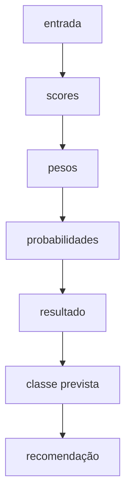
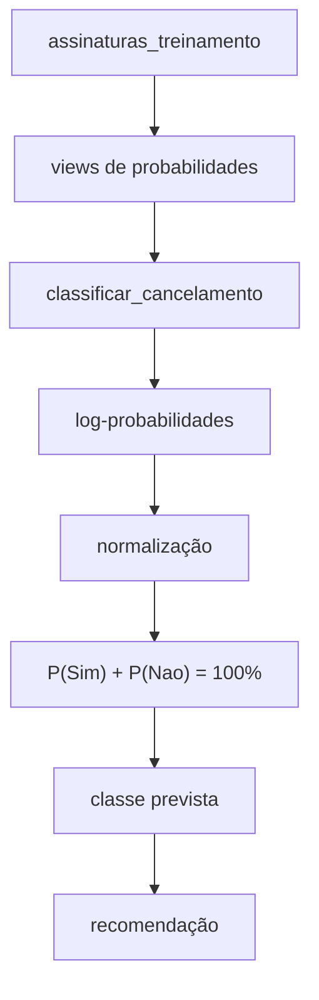

# Documentação SQL — Functions

## Visão geral

Este documento descreve as funções SQL localizadas em:

```text
sql/functions/
```

Atualmente:

```text
sql/
└── functions/
    └── classificar_cancelamento.sql
```

A função `classificar_cancelamento()` executa a etapa de inferência do classificador Naive Bayes.

Ela recebe uma nova assinatura, consulta as probabilidades aprendidas a partir dos dados de treinamento e retorna:

- probabilidade da classe `Sim`;
- probabilidade da classe `Nao`;
- classe prevista;
- recomendação.

---

# `classificar_cancelamento.sql`

## Objetivo

A função recebe as oito features de uma nova assinatura:

```sql
-- Classifica uma assinatura pelas probabilidades calculadas nas views.
CREATE OR REPLACE FUNCTION classificar_cancelamento(
    p_plano_assinatura TEXT,
    p_frequencia_uso TEXT,
    p_tempo_desde_ultimo_acesso TEXT,
    p_uso_beneficios_plano TEXT,
    p_variacao_preco TEXT,
    p_percepcao_custo_beneficio TEXT,
    p_nivel_satisfacao TEXT,
    p_falhas_pagamento TEXT
)
RETURNS TABLE (
    probabilidade_sim NUMERIC(6,2),
    probabilidade_nao NUMERIC(6,2),
    classe_prevista TEXT,
    recomendacao TEXT
)
LANGUAGE plpgsql
AS $$
BEGIN
    IF EXISTS (
        SELECT 1
        FROM (
            VALUES
                ('plano_assinatura', p_plano_assinatura),
                ('frequencia_uso', p_frequencia_uso),
                ('tempo_desde_ultimo_acesso', p_tempo_desde_ultimo_acesso),
                ('uso_beneficios_plano', p_uso_beneficios_plano),
                ('variacao_preco', p_variacao_preco),
                ('percepcao_custo_beneficio', p_percepcao_custo_beneficio),
                ('nivel_satisfacao', p_nivel_satisfacao),
                ('falhas_pagamento', p_falhas_pagamento)
        ) AS entrada(feature, valor)
        LEFT JOIN feature_domains USING (feature, valor)
        WHERE feature_domains.feature IS NULL
    ) THEN
        RAISE EXCEPTION 'Entrada inválida para classificar_cancelamento';
    END IF;

    RETURN QUERY
    WITH entrada(feature, valor) AS (
        VALUES
            ('plano_assinatura', p_plano_assinatura),
            ('frequencia_uso', p_frequencia_uso),
            ('tempo_desde_ultimo_acesso', p_tempo_desde_ultimo_acesso),
            ('uso_beneficios_plano', p_uso_beneficios_plano),
            ('variacao_preco', p_variacao_preco),
            ('percepcao_custo_beneficio', p_percepcao_custo_beneficio),
            ('nivel_satisfacao', p_nivel_satisfacao),
            ('falhas_pagamento', p_falhas_pagamento)
    ),
    scores AS (
        SELECT
            class_priors.classe,
            LN(class_priors.probabilidade) + SUM(LN(likelihoods.probabilidade)) AS log_score
        FROM class_priors
        JOIN likelihoods ON likelihoods.classe = class_priors.classe
        JOIN entrada ON entrada.feature = likelihoods.feature AND entrada.valor = likelihoods.valor
        GROUP BY class_priors.classe, class_priors.probabilidade
    ),
    pesos AS (
        SELECT classe, EXP(log_score - MAX(log_score) OVER ()) AS peso
        FROM scores
    ),
    probabilidades AS (
        SELECT classe, (peso / SUM(peso) OVER ()) * 100 AS percentual
        FROM pesos
    ),
    resultado AS (
        SELECT
            MAX(percentual) FILTER (WHERE classe = 'Sim') AS p_sim,
            MAX(percentual) FILTER (WHERE classe = 'Nao') AS p_nao
        FROM probabilidades
    )
    SELECT
        ROUND(p_sim::NUMERIC, 2),
        ROUND(p_nao::NUMERIC, 2),
        CASE WHEN p_sim >= p_nao THEN 'Sim'::TEXT ELSE 'Nao'::TEXT END,
        CASE
            WHEN p_sim >= 90 THEN 'Risco muito alto de cancelamento.'::TEXT
            WHEN p_sim >= 70 THEN 'Alto risco de cancelamento.'::TEXT
            WHEN p_sim >= 50 THEN 'A assinatura tende ao cancelamento; faça uma intervenção.'::TEXT
            WHEN p_nao >= 90 THEN 'Risco muito baixo de cancelamento.'::TEXT
            WHEN p_nao >= 70 THEN 'Baixo risco de cancelamento.'::TEXT
            WHEN p_nao >= 50 THEN 'A assinatura tende à permanência, mas requer acompanhamento.'::TEXT
            ELSE 'Cenário equilibrado. Recomenda-se análise adicional.'::TEXT
        END
    FROM resultado;
END;
$$;
```

As features correspondem a:

1. plano de assinatura;
2. frequência de uso;
3. tempo desde o último acesso;
4. uso de benefícios do plano;
5. variação de preço;
6. percepção de custo-benefício;
7. nível de satisfação;
8. falhas de pagamento.

---

## Retorno

```sql
RETURNS TABLE (
    probabilidade_sim NUMERIC(6,2),
    probabilidade_nao NUMERIC(6,2),
    classe_prevista TEXT,
    recomendacao TEXT
)
```

A função retorna uma única linha.

| Campo | Significado |
|---|---|
| `probabilidade_sim` | probabilidade percentual da classe `Sim` |
| `probabilidade_nao` | probabilidade percentual da classe `Nao` |
| `classe_prevista` | classe com maior probabilidade |
| `recomendacao` | interpretação textual do resultado |

---

# Fluxo interno

A classificação é dividida em CTEs:



---

# 1. CTE `entrada`

```sql
entrada(feature, valor) AS (
    VALUES
        ('plano_assinatura', p_plano_assinatura),
        ('frequencia_uso', p_frequencia_uso),
        ('tempo_desde_ultimo_acesso', p_tempo_desde_ultimo_acesso),
        ('uso_beneficios_plano', p_uso_beneficios_plano),
        ('variacao_preco', p_variacao_preco),
        ('percepcao_custo_beneficio', p_percepcao_custo_beneficio),
        ('nivel_satisfacao', p_nivel_satisfacao),
        ('falhas_pagamento', p_falhas_pagamento)
)
```

## Objetivo

Os parâmetros chegam à função como oito valores separados.

A CTE `entrada` converte esses valores para o mesmo formato utilizado pelas views:

```text
feature                       valor
----------------------------  ---------
plano_assinatura              Basico
frequencia_uso                Baixa
tempo_desde_ultimo_acesso     Longo
...
```

Isso permite fazer o `JOIN` entre a entrada e a view `likelihoods`.

---

# 2. Score do Naive Bayes

## Forma tradicional

Para uma classe `C`, o Naive Bayes calcula:

$$
P(C \mid X) \propto P(C) \times P(X_1 \mid C) \times P(X_2 \mid C) \times \cdots \times P(X_n \mid C)
$$

Neste projeto:

$$
\mathrm{Score}(\text{Sim}) =
P(\text{Sim})
\times P(\text{plano} \mid \text{Sim})
\times P(\text{frequência de uso} \mid \text{Sim})
\times P(\text{tempo desde o último acesso} \mid \text{Sim})
\times \cdots
$$

O mesmo cálculo é realizado para `Nao`.

---

# 3. Uso de log-probabilidades

## Problema do underflow

Probabilidades são valores menores que ou iguais a `1`.

Ao multiplicar muitos valores pequenos:

$$
0.5 \times 0.42 \times 0.35 \times 0.38 \times 0.31 \times \cdots
$$

o resultado pode se tornar extremamente pequeno.

Isso pode causar **underflow numérico**.

## Solução

O classificador usa a propriedade:

$$
\log(a \times b) = \log(a) + \log(b)
$$

Assim, em vez de multiplicar probabilidades, ele soma seus logaritmos.

---

# 4. CTE `scores`

```sql
scores AS (
    SELECT
        class_priors.classe,
        LN(class_priors.probabilidade)
        + SUM(LN(likelihoods.probabilidade)) AS log_score

    FROM class_priors

    -- Junta cada classe às suas verossimilhanças correspondentes.
    -- Assim, Sim usa as probabilidades de Sim e Nao usa as de Nao.
    JOIN likelihoods
        ON likelihoods.classe = class_priors.classe

    -- Encontra em likelihoods os oito valores recebidos no cenário.
    -- Cada feature da entrada deve combinar com a mesma feature e valor.
    JOIN entrada
        ON entrada.feature = likelihoods.feature
        AND entrada.valor = likelihoods.valor

    -- Junta as oito features de cada classe para formar um único score.
    GROUP BY
        class_priors.classe,
        class_priors.probabilidade
)
```

Essa é a etapa principal do cálculo.

---

## `LN(class_priors.probabilidade)`

```sql
LN(class_priors.probabilidade)
```

Calcula:

$$
\ln P(\text{classe})
$$

Por exemplo:

$$
\begin{aligned}
\ln P(\text{Sim}) \\
\ln P(\text{Nao})
\end{aligned}
$$

---

## `SUM(LN(likelihoods.probabilidade))`

```sql
SUM(LN(likelihoods.probabilidade))
```

Calcula:

$$
\ln P(X_1 \mid C)
+ \ln P(X_2 \mid C)
+ \cdots
+ \ln P(X_8 \mid C)
$$

---

## Fórmula final do score

$$
\mathrm{log\_score}(C)
= \ln P(C)
+ \sum_{i=1}^{n} \ln P(X_i \mid C)
$$

O PostgreSQL calcula um `log_score` para cada classe.

---

# 5. CTE `pesos`

```sql
pesos AS (
    SELECT
        classe,
        EXP(log_score - MAX(log_score) OVER ()) AS peso

    FROM scores
)
```

## Objetivo

Essa CTE faz duas coisas: encontra o maior score e converte os scores logarítmicos para pesos positivos.

O `MAX(log_score) OVER ()` encontra o maior score sem remover as linhas das classes. Depois, esse valor é subtraído de cada score.

Suponha:

$$
\begin{aligned}
\text{Sim} &= -10.2 \\
\text{Nao} &= -13.7
\end{aligned}
$$

O maior score é `-10.2`. Assim:

$$
\begin{aligned}
\text{Sim} &= -10.2 - (-10.2) = 0 \\
\text{Nao} &= -13.7 - (-10.2) = -3.5
\end{aligned}
$$

Essa transformação melhora a estabilidade numérica e não altera a comparação entre as classes.

Depois, `EXP()` converte os resultados em pesos positivos.

A função:

```sql
EXP(x)
```

representa:

$$
e^x
$$

Como o maior score foi subtraído anteriormente, a classe de maior score recebe:

$$
\exp(0) = 1
$$

A outra classe recebe um valor entre `0` e `1`.

Esses valores ainda são pesos relativos, não percentuais.

---

# 6. CTE `probabilidades`

```sql
probabilidades AS (
    SELECT
        classe,

        (peso / SUM(peso) OVER ()) * 100 AS percentual

    FROM pesos
)
```

## Objetivo

Normaliza os pesos para que o resultado final esteja entre `0%` e `100%`.

A fórmula é:

$$
P_{\text{final}}(C) = \frac{\mathrm{peso}(C)}{\sum \mathrm{pesos}} \times 100
$$

Exemplo:

$$
\begin{aligned}
\text{Sim} &= 1.00 \\
\text{Nao} &= 0.25
\end{aligned}
$$

Logo:

$$
\begin{aligned}
P(\text{Sim}) &= \frac{1}{1.25} \times 100 = 80\% \\
P(\text{Nao}) &= \frac{0.25}{1.25} \times 100 = 20\%
\end{aligned}
$$

Portanto:

$$
P(\text{Sim}) + P(\text{Nao}) = 100\%
$$

---

# 7. CTE `resultado`

```sql
resultado AS (
    -- Reúne as probabilidades das duas classes em uma única linha.
    SELECT

        -- Seleciona o percentual da classe Sim.
        MAX(percentual) FILTER (WHERE classe = 'Sim') AS p_sim,

        -- Seleciona o percentual da classe Nao.
        MAX(percentual) FILTER (WHERE classe = 'Nao') AS p_nao

    FROM probabilidades
)
```

## Objetivo

Antes dessa etapa, as probabilidades estão em linhas:

```text
classe  percentual
------  ----------
Sim     80.00
Nao     20.00
```

A CTE converte essas linhas em colunas:

```text
p_sim  p_nao
-----  -----
80.00  20.00
```

---

## Uso de `FILTER`

```sql
FILTER (
    WHERE classe = 'Sim'
)
```

faz com que a agregação considere apenas o percentual da classe `Sim`.

A mesma lógica é aplicada a `Nao`.

---

# 8. Seleção da classe prevista

```sql
CASE
    WHEN p_sim >= p_nao
        THEN 'Sim'::TEXT

    ELSE
        'Nao'::TEXT
END
```

A classe com maior probabilidade é escolhida como resultado.

A regra é:

$$
\text{classe prevista} =
\begin{cases}
\text{Sim}, & \text{se } P(\text{Sim}) \ge P(\text{Nao}) \\
\text{Nao}, & \text{caso contrário}
\end{cases}
$$

Em caso de empate, `Sim` é escolhida devido ao operador:

```sql
>=
```

---

# 9. Recomendação

A função também gera uma interpretação do resultado:

```sql
CASE
    WHEN p_sim >= 90 THEN
        'Risco muito alto de cancelamento.'::TEXT

    WHEN p_sim >= 70 THEN
        'Alto risco de cancelamento.'::TEXT

    WHEN p_sim >= 50 THEN
        'A assinatura tende ao cancelamento; faça uma intervenção.'::TEXT

    WHEN p_nao >= 90 THEN
        'Risco muito baixo de cancelamento.'::TEXT

    WHEN p_nao >= 70 THEN
        'Baixo risco de cancelamento.'::TEXT

    WHEN p_nao >= 50 THEN
        'A assinatura tende à permanência, mas requer acompanhamento.'::TEXT

    ELSE
        'Cenário equilibrado. Recomenda-se análise adicional.'::TEXT
END
```

As faixas são:

| Condição | Recomendação |
|---|---|
| `P(Sim) >= 90%` | risco muito alto de cancelamento |
| `P(Sim) >= 70%` | alto risco de cancelamento |
| `50% <= P(Sim) < 70%` | tendência ao cancelamento, com intervenção recomendada |
| `P(Nao) >= 90%` | risco muito baixo de cancelamento |
| `P(Nao) >= 70%` | baixo risco de cancelamento |
| `50% <= P(Nao) < 70%` | tendência à permanência, com acompanhamento |
| demais casos | cenário equilibrado |

A recomendação não participa do algoritmo Naive Bayes.

Ela interpreta apenas a probabilidade final já calculada.

---

# Exemplo de classificação

```sql
SELECT *
FROM classificar_cancelamento(
    'Basico',
    'Baixa',
    'Longo',
    'Baixo',
    'Aumentou',
    'Baixa',
    'Baixo',
    'Recorrente'
);
```

Os parâmetros são, na ordem:

```text
1. plano de assinatura
2. frequência de uso
3. tempo desde o último acesso
4. uso de benefícios do plano
5. variação de preço
6. percepção de custo-benefício
7. nível de satisfação
8. falhas de pagamento
```

A saída possui o formato:

```text
probabilidade_sim | probabilidade_nao | classe_prevista | recomendacao
------------------+-------------------+-----------------+----------------------------
100.00            | 0.00              | Sim             | Risco muito alto de cancelamento.
```

Com o CSV atual, os valores sem arredondamento desse cenário são `99,9983367%`
para `Sim` e `0,0016633%` para `Nao`. A função arredonda ambos para duas casas
decimais antes de retorná-los.

No cenário de exemplo acima, os sinais combinados indicam risco alto. Como o modelo recebe categorias, duas assinaturas com o mesmo vetor categórico recebem as mesmas probabilidades; isso evidencia o limite da discretização.

---

# Resumo matemático

## Probabilidade a priori

$$
P(C) = \frac{N(C)}{N}
$$

## Verossimilhança com Laplace

$$
P(X=v \mid C) = \frac{N(X=v, C) + 1}{N(C) + K}
$$

## Score em log

$$
\mathrm{log\_score}(C)
= \ln P(C)
+ \sum_{i=1}^{n} \ln P(X_i \mid C)
$$

## Estabilização

$$
\mathrm{score\_estabilizado}(C)
= \mathrm{log\_score}(C)
- \max\bigl(\mathrm{log\_score}\bigr)
$$

## Peso

$$
\mathrm{peso}(C)
= \exp\left(\mathrm{score\_estabilizado}(C)\right)
$$

## Normalização

$$
P_{\text{final}}(C)
= \frac{\mathrm{peso}(C)}{\sum_{c} \mathrm{peso}(c)} \times 100
$$

## Decisão

$$
\text{classe prevista}
= \arg\max_{C} P_{\text{final}}(C)
$$

---

# Dependências da função

A função depende das seguintes views:

```text
class_priors
likelihoods
```

Essas views, por sua vez, dependem dos dados armazenados em:

```text
assinaturas_treinamento
```

O fluxo final é:


