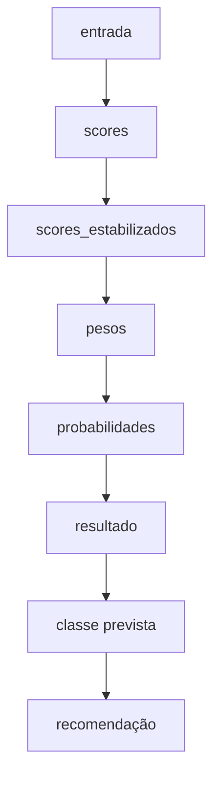
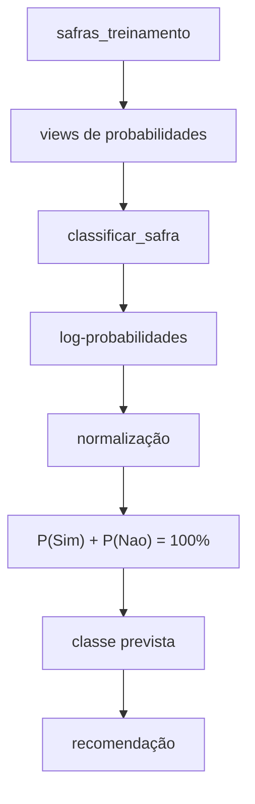

# Documentação SQL — Functions

## Visão geral

Este documento descreve as funções SQL localizadas em:

```text
sql/functions/
```

Atualmente:

```text
sql/
└── functions/
    └── classificar_safra.sql
```

A função `classificar_safra()` executa a etapa de inferência do classificador Naive Bayes.

Ela recebe uma nova safra, consulta as probabilidades aprendidas a partir dos dados de treinamento e retorna:

- probabilidade da classe `Sim`;
- probabilidade da classe `Nao`;
- classe prevista;
- recomendação.

---

# `classificar_safra.sql`

## Objetivo

A função recebe as oito features de uma nova safra:

```sql
CREATE OR REPLACE FUNCTION classificar_safra(
    p_produtividade_estimada TEXT,
    p_preco_esperado_venda TEXT,
    p_custo_total_producao TEXT,
    p_precipitacao_acumulada TEXT,
    p_temperatura_media TEXT,
    p_incidencia_pragas_doencas TEXT,
    p_custo_insumos_agricolas TEXT,
    p_historico_produtividade TEXT
)
```

As features correspondem a:

1. produtividade estimada;
2. preço esperado de venda;
3. custo total de produção por hectare;
4. precipitação acumulada;
5. temperatura média;
6. incidência de pragas e doenças;
7. custo dos insumos agrícolas;
8. histórico de produtividade da área.

---

## Retorno

```sql
RETURNS TABLE (
    probabilidade_sim NUMERIC(6,2),
    probabilidade_nao NUMERIC(6,2),
    classe_prevista TEXT,
    recomendacao TEXT
)
```

A função retorna uma única linha.

| Campo | Significado |
|---|---|
| `probabilidade_sim` | probabilidade percentual da classe `Sim` |
| `probabilidade_nao` | probabilidade percentual da classe `Nao` |
| `classe_prevista` | classe com maior probabilidade |
| `recomendacao` | interpretação textual do resultado |

---

# Fluxo interno

A classificação é dividida em CTEs:



---

# 1. CTE `entrada`

```sql
entrada(feature, valor) AS (
    VALUES
        (
            'produtividade_estimada',
            p_produtividade_estimada
        ),
        (
            'preco_esperado_venda',
            p_preco_esperado_venda
        ),
        (
            'custo_total_producao',
            p_custo_total_producao
        ),
        (
            'precipitacao_acumulada',
            p_precipitacao_acumulada
        ),
        (
            'temperatura_media',
            p_temperatura_media
        ),
        (
            'incidencia_pragas_doencas',
            p_incidencia_pragas_doencas
        ),
        (
            'custo_insumos_agricolas',
            p_custo_insumos_agricolas
        ),
        (
            'historico_produtividade',
            p_historico_produtividade
        )
)
```

## Objetivo

Os parâmetros chegam à função como oito valores separados.

A CTE `entrada` converte esses valores para o mesmo formato utilizado pelas views:

```text
feature                       valor
----------------------------  ---------
produtividade_estimada        Alta
preco_esperado_venda          Alto
custo_total_producao          Médio
...
```

Isso permite fazer o `JOIN` entre a entrada e a view `likelihoods`.

---

# 2. Score do Naive Bayes

## Forma tradicional

Para uma classe `C`, o Naive Bayes calcula:

$$
P(C \mid X) \propto P(C) \times P(X_1 \mid C) \times P(X_2 \mid C) \times \cdots \times P(X_n \mid C)
$$

Neste projeto:

$$
\mathrm{Score}(\text{Sim}) =
P(\text{Sim})
\times P(\text{produtividade} \mid \text{Sim})
\times P(\text{preço} \mid \text{Sim})
\times P(\text{custo} \mid \text{Sim})
\times \cdots
$$

O mesmo cálculo é realizado para `Nao`.

---

# 3. Uso de log-probabilidades

## Problema do underflow

Probabilidades são valores menores que ou iguais a `1`.

Ao multiplicar muitos valores pequenos:

$$
0.5 \times 0.42 \times 0.35 \times 0.38 \times 0.31 \times \cdots
$$

o resultado pode se tornar extremamente pequeno.

Isso pode causar **underflow numérico**.

## Solução

O classificador usa a propriedade:

$$
\log(a \times b) = \log(a) + \log(b)
$$

Assim, em vez de multiplicar probabilidades, ele soma seus logaritmos.

---

# 4. CTE `scores`

```sql
scores AS (
    SELECT
        prior.classe,

        LN(
            prior.probabilidade::DOUBLE PRECISION
        )
        +
        SUM(
            LN(
                likelihood.probabilidade::DOUBLE PRECISION
            )
        ) AS log_score

    FROM class_priors prior

    JOIN likelihoods likelihood
        ON likelihood.classe = prior.classe

    JOIN entrada e
        ON e.feature = likelihood.feature
        AND e.valor = likelihood.valor

    GROUP BY
        prior.classe,
        prior.probabilidade
)
```

Essa é a etapa principal do cálculo.

---

## `LN(prior.probabilidade)`

```sql
LN(
    prior.probabilidade::DOUBLE PRECISION
)
```

Calcula:

$$
\ln P(\text{classe})
$$

Por exemplo:

$$
\begin{aligned}
\ln P(\text{Sim}) \\
\ln P(\text{Nao})
\end{aligned}
$$

---

## `SUM(LN(likelihood.probabilidade))`

```sql
SUM(
    LN(
        likelihood.probabilidade::DOUBLE PRECISION
    )
)
```

Calcula:

$$
\ln P(X_1 \mid C)
+ \ln P(X_2 \mid C)
+ \cdots
+ \ln P(X_8 \mid C)
$$

---

## Fórmula final do score

$$
\mathrm{log\_score}(C)
= \ln P(C)
+ \sum_{i=1}^{n} \ln P(X_i \mid C)
$$

O PostgreSQL calcula um `log_score` para cada classe.

---

# 5. CTE `scores_estabilizados`

```sql
scores_estabilizados AS (
    SELECT
        classe,
        log_score,

        MAX(log_score) OVER ()
            AS maior_log_score

    FROM scores
)
```

## Objetivo

Antes de aplicar `EXP()`, o algoritmo encontra o maior log-score.

Suponha:

$$
\begin{aligned}
\text{Sim} &= -10.2 \\
\text{Nao} &= -13.7
\end{aligned}
$$

O maior valor é:

$$
-10.2
$$

Posteriormente:

$$
\begin{aligned}
\text{Sim} &= -10.2 - (-10.2) = 0 \\
\text{Nao} &= -13.7 - (-10.2) = -3.5
\end{aligned}
$$

Essa transformação melhora a estabilidade numérica e não altera a proporção entre as classes.

---

## `MAX(log_score) OVER ()`

```sql
MAX(log_score) OVER ()
```

É uma função de janela.

Ela calcula o maior score mantendo as linhas individuais das classes.

---

# 6. CTE `pesos`

```sql
pesos AS (
    SELECT
        classe,

        EXP(
            log_score - maior_log_score
        ) AS peso

    FROM scores_estabilizados
)
```

## Objetivo

Converte os scores logarítmicos novamente para uma escala linear.

A função:

```sql
EXP(x)
```

representa:

$$
e^x
$$

Como o maior score foi subtraído anteriormente, a classe de maior score recebe:

$$
\exp(0) = 1
$$

A outra classe recebe um valor entre `0` e `1`.

Esses valores ainda são pesos relativos, não percentuais.

---

# 7. CTE `probabilidades`

```sql
probabilidades AS (
    SELECT
        classe,

        (
            peso
            /
            SUM(peso) OVER ()
        ) * 100 AS percentual

    FROM pesos
)
```

## Objetivo

Normaliza os pesos para que o resultado final esteja entre `0%` e `100%`.

A fórmula é:

$$
P_{\text{final}}(C) = \frac{\mathrm{peso}(C)}{\sum \mathrm{pesos}} \times 100
$$

Exemplo:

$$
\begin{aligned}
\text{Sim} &= 1.00 \\
\text{Nao} &= 0.25
\end{aligned}
$$

Logo:

$$
\begin{aligned}
P(\text{Sim}) &= \frac{1}{1.25} \times 100 = 80\% \\
P(\text{Nao}) &= \frac{0.25}{1.25} \times 100 = 20\%
\end{aligned}
$$

Portanto:

$$
P(\text{Sim}) + P(\text{Nao}) = 100\%
$$

---

# 8. CTE `resultado`

```sql
resultado AS (
    SELECT

        MAX(percentual)
            FILTER (
                WHERE classe = 'Sim'
            ) AS p_sim,

        MAX(percentual)
            FILTER (
                WHERE classe = 'Nao'
            ) AS p_nao

    FROM probabilidades
)
```

## Objetivo

Antes dessa etapa, as probabilidades estão em linhas:

```text
classe  percentual
------  ----------
Sim     80.00
Nao     20.00
```

A CTE converte essas linhas em colunas:

```text
p_sim  p_nao
-----  -----
80.00  20.00
```

---

## Uso de `FILTER`

```sql
FILTER (
    WHERE classe = 'Sim'
)
```

faz com que a agregação considere apenas o percentual da classe `Sim`.

A mesma lógica é aplicada a `Nao`.

---

# 9. Seleção da classe prevista

```sql
CASE
    WHEN p_sim >= p_nao
        THEN 'Sim'::TEXT

    ELSE
        'Nao'::TEXT
END
```

A classe com maior probabilidade é escolhida como resultado.

A regra é:

$$
\text{classe prevista} =
\begin{cases}
\text{Sim}, & \text{se } P(\text{Sim}) \ge P(\text{Nao}) \\
\text{Nao}, & \text{caso contrário}
\end{cases}
$$

Em caso de empate, `Sim` é escolhida devido ao operador:

```sql
>=
```

---

# 10. Recomendação

A função também gera uma interpretação do resultado:

```sql
CASE
    WHEN p_sim >= 90 THEN
        'Probabilidade muito alta de rentabilidade.'::TEXT

    WHEN p_sim >= 70 THEN
        'Alta probabilidade de rentabilidade.'::TEXT

    WHEN p_sim >= 50 THEN
        'A safra tende a ser rentável, mas apresenta fatores de risco.'::TEXT

    WHEN p_nao >= 90 THEN
        'Probabilidade muito alta de não rentabilidade.'::TEXT

    WHEN p_nao >= 70 THEN
        'Alto risco de não rentabilidade.'::TEXT

    WHEN p_nao >= 50 THEN
        'A safra tende a não ser rentável, mas o cenário não é definitivo.'::TEXT

    ELSE
        'Cenário equilibrado. Recomenda-se análise adicional.'::TEXT
END
```

As faixas são:

| Condição | Recomendação |
|---|---|
| `P(Sim) >= 90%` | probabilidade muito alta de rentabilidade |
| `P(Sim) >= 70%` | alta probabilidade de rentabilidade |
| `50% <= P(Sim) < 70%` | tendência de rentabilidade com fatores de risco |
| `P(Nao) >= 90%` | probabilidade muito alta de não rentabilidade |
| `P(Nao) >= 70%` | alto risco de não rentabilidade |
| `50% <= P(Nao) < 70%` | tendência de não rentabilidade, mas sem certeza |
| demais casos | cenário equilibrado |

A recomendação não participa do algoritmo Naive Bayes.

Ela interpreta apenas a probabilidade final já calculada.

---

# Exemplo de classificação

```sql
SELECT *
FROM classificar_safra(
    'Alta',
    'Alto',
    'Médio',
    'Adequada',
    'Adequada',
    'Baixa',
    'Normal',
    'Alto'
);
```

Os parâmetros são, na ordem:

```text
1. produtividade estimada
2. preço esperado de venda
3. custo total de produção
4. precipitação acumulada
5. temperatura média
6. incidência de pragas e doenças
7. custo dos insumos agrícolas
8. histórico de produtividade
```

A saída possui o formato:

```text
probabilidade_sim | probabilidade_nao | classe_prevista | recomendacao
------------------+-------------------+-----------------+----------------------------
93.59             | 6.41              | Sim             | Probabilidade muito alta...
```

Os valores dependem dos registros existentes em `safras_treinamento`.

No resultado exibido por `scripts/test.sh`, as probabilidades recebem o sufixo `%`:

```text
caso | nome_safra | probabilidade_sim | probabilidade_nao | classe_prevista | recomendacao
01_baixo_risco | Soja | 97.38% | 2.62% | Sim | Probabilidade muito alta de rentabilidade.
```

Os cenários 07 e 08 repetem exatamente as mesmas oito features e mudam apenas
`nome_safra`. Como esse campo é apenas identificador, as duas linhas devem
apresentar as mesmas probabilidades e a mesma classe. Isso evidencia que o
modelo não diferencia culturas quando elas possuem o mesmo perfil categórico.

---

# Resumo matemático

## Probabilidade a priori

$$
P(C) = \frac{N(C)}{N}
$$

## Verossimilhança com Laplace

$$
P(X=v \mid C) = \frac{N(X=v, C) + 1}{N(C) + K}
$$

## Score em log

$$
\mathrm{log\_score}(C)
= \ln P(C)
+ \sum_{i=1}^{n} \ln P(X_i \mid C)
$$

## Estabilização

$$
\mathrm{score\_estabilizado}(C)
= \mathrm{log\_score}(C)
- \max\bigl(\mathrm{log\_score}\bigr)
$$

## Peso

$$
\mathrm{peso}(C)
= \exp\left(\mathrm{score\_estabilizado}(C)\right)
$$

## Normalização

$$
P_{\text{final}}(C)
= \frac{\mathrm{peso}(C)}{\sum_{c} \mathrm{peso}(c)} \times 100
$$

## Decisão

$$
\text{classe prevista}
= \arg\max_{C} P_{\text{final}}(C)
$$

---

# Dependências da função

A função depende das seguintes views:

```text
class_priors
likelihoods
```

Essas views, por sua vez, dependem dos dados armazenados em:

```text
safras_treinamento
```

O fluxo final é:


