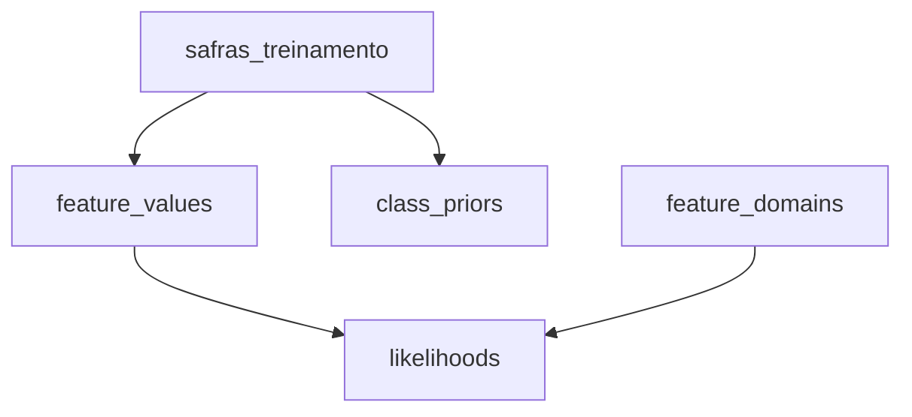

# Documentação SQL — Views

## Visão geral

Este documento descreve as views localizadas em:

```text
sql/views/
```

A estrutura atual é:

```text
sql/
└── views/
    ├── feature_domains.sql
    ├── feature_values.sql
    ├── class_priors.sql
    └── likelihoods.sql
```

As views representam as etapas intermediárias do treinamento estatístico do Naive Bayes.

O fluxo principal é:



---

# `feature_domains.sql`

## Objetivo

A view `feature_domains` registra todas as categorias possíveis de cada feature.

Ela é necessária principalmente para a suavização de Laplace.

```sql
CREATE OR REPLACE VIEW feature_domains AS

SELECT *
FROM (
    VALUES
        ('produtividade_estimada', 'Baixa'),
        ('produtividade_estimada', 'Média'),
        ('produtividade_estimada', 'Alta'),

        ('preco_esperado_venda', 'Baixo'),
        ('preco_esperado_venda', 'Normal'),
        ('preco_esperado_venda', 'Alto'),

        ('custo_total_producao', 'Baixo'),
        ('custo_total_producao', 'Médio'),
        ('custo_total_producao', 'Alto'),

        ('precipitacao_acumulada', 'Insuficiente'),
        ('precipitacao_acumulada', 'Adequada'),
        ('precipitacao_acumulada', 'Excessiva'),

        ('temperatura_media', 'Abaixo da faixa ideal'),
        ('temperatura_media', 'Adequada'),
        ('temperatura_media', 'Acima da faixa ideal'),

        ('incidencia_pragas_doencas', 'Baixa'),
        ('incidencia_pragas_doencas', 'Moderada'),
        ('incidencia_pragas_doencas', 'Alta'),

        ('custo_insumos_agricolas', 'Baixo'),
        ('custo_insumos_agricolas', 'Normal'),
        ('custo_insumos_agricolas', 'Alto'),

        ('historico_produtividade', 'Baixo'),
        ('historico_produtividade', 'Médio'),
        ('historico_produtividade', 'Alto')

) AS dominio(feature, valor);
```

## Estrutura gerada

A view possui duas colunas:

```text
feature
valor
```

Exemplo:

```text
feature                         valor
------------------------------  ----------------------
produtividade_estimada          Baixa
produtividade_estimada          Média
produtividade_estimada          Alta
preco_esperado_venda            Baixo
preco_esperado_venda            Normal
preco_esperado_venda            Alto
...
```

## Por que essa view existe?

O Naive Bayes precisa conhecer quantas categorias possíveis existem para cada feature.

Por exemplo:

```text
produtividade_estimada
```

possui:

```text
Baixa
Média
Alta
```

Logo:

$$
K = 3
$$

Esse valor é usado na suavização de Laplace:

$$
P(X=v \mid C) = \frac{\text{contagem} + 1}{N(C) + K}
$$

## Uso de `VALUES`

O trecho:

```sql
VALUES
    ('produtividade_estimada', 'Baixa'),
    ('produtividade_estimada', 'Média'),
    ('produtividade_estimada', 'Alta')
```

cria linhas diretamente dentro da consulta.

Depois:

```sql
AS dominio(feature, valor)
```

define o nome das colunas resultantes.

---

# `feature_values.sql`

## Objetivo

Esta view transforma os registros da tabela `safras_treinamento` de um formato baseado em colunas para um formato baseado em pares:

```text
feature → valor
```

```sql
CREATE OR REPLACE VIEW feature_values AS

SELECT
    s.id,
    s.rentavel AS classe,
    f.feature,
    f.valor

FROM safras_treinamento s

CROSS JOIN LATERAL (
    VALUES
        (
            'produtividade_estimada',
            s.produtividade_estimada
        ),
        (
            'preco_esperado_venda',
            s.preco_esperado_venda
        ),
        (
            'custo_total_producao',
            s.custo_total_producao
        ),
        (
            'precipitacao_acumulada',
            s.precipitacao_acumulada
        ),
        (
            'temperatura_media',
            s.temperatura_media
        ),
        (
            'incidencia_pragas_doencas',
            s.incidencia_pragas_doencas
        ),
        (
            'custo_insumos_agricolas',
            s.custo_insumos_agricolas
        ),
        (
            'historico_produtividade',
            s.historico_produtividade
        )

) AS f(feature, valor);
```

## Exemplo da transformação

Um registro original pode ser:

```text
id = 1
produtividade_estimada = Alta
preco_esperado_venda = Alto
custo_total_producao = Médio
precipitacao_acumulada = Adequada
temperatura_media = Adequada
incidencia_pragas_doencas = Baixa
custo_insumos_agricolas = Normal
historico_produtividade = Alto
rentavel = Sim
```

A view gera:

```text
id  classe  feature                       valor
--  ------  ----------------------------  ---------
1   Sim     produtividade_estimada        Alta
1   Sim     preco_esperado_venda          Alto
1   Sim     custo_total_producao          Médio
1   Sim     precipitacao_acumulada        Adequada
1   Sim     temperatura_media             Adequada
1   Sim     incidencia_pragas_doencas     Baixa
1   Sim     custo_insumos_agricolas       Normal
1   Sim     historico_produtividade       Alto
```

## Por que isso é útil?

O Naive Bayes precisa responder perguntas como:

```text
Quantas vezes produtividade_estimada = Alta
apareceu na classe Sim?
```

ou:

```text
Quantas vezes precipitacao_acumulada = Insuficiente
apareceu na classe Nao?
```

Com todas as features representadas pelas colunas:

```text
classe
feature
valor
```

as contagens podem ser feitas de forma uniforme.

## `CROSS JOIN LATERAL`

```sql
CROSS JOIN LATERAL (
    VALUES
        ...
) AS f(feature, valor)
```

O `LATERAL` permite que o bloco interno utilize as colunas do registro atual da tabela, como:

```sql
s.produtividade_estimada
s.preco_esperado_venda
```

Cada registro da tabela gera oito linhas na view.

---

# `class_priors.sql`

## Objetivo

Esta view calcula as probabilidades a priori das classes:

$$
P(C)
$$

```sql
CREATE OR REPLACE VIEW class_priors AS

WITH total AS (
    SELECT
        COUNT(*) AS quantidade
    FROM safras_treinamento
)

SELECT
    s.rentavel AS classe,

    COUNT(*) AS quantidade,

    COUNT(*)::NUMERIC
        / total.quantidade AS probabilidade

FROM safras_treinamento s

CROSS JOIN total

GROUP BY
    s.rentavel,
    total.quantidade;
```

## Fórmula

$$
P(C) = \frac{N(C)}{N}
$$

No conjunto de 120 registros balanceados:

```text
Sim = 60
Nao = 60
```

Logo:

$$
\begin{aligned}
P(\text{Sim}) &= \frac{60}{120} = 0.5 \\
P(\text{Nao}) &= \frac{60}{120} = 0.5
\end{aligned}
$$

## CTE `total`

```sql
WITH total AS (
    SELECT
        COUNT(*) AS quantidade
    FROM safras_treinamento
)
```

Calcula o total de registros do conjunto de treinamento.

## Contagem por classe

```sql
COUNT(*) AS quantidade
```

Como a consulta utiliza:

```sql
GROUP BY s.rentavel
```

o PostgreSQL calcula uma contagem para cada classe.

## Conversão para `NUMERIC`

```sql
COUNT(*)::NUMERIC
```

Garante uma divisão decimal na expressão de probabilidade.

---

# `likelihoods.sql`

## Objetivo

Esta view calcula as verossimilhanças:

$$
P(\text{feature} = \text{valor} \mid \text{classe})
$$

e aplica suavização de Laplace.

```sql
CREATE OR REPLACE VIEW likelihoods AS

WITH

contagem_classe AS (
    SELECT
        rentavel AS classe,
        COUNT(*) AS quantidade

    FROM safras_treinamento

    GROUP BY rentavel
),

cardinalidade AS (
    SELECT
        feature,
        COUNT(*) AS quantidade_categorias

    FROM feature_domains

    GROUP BY feature
),

contagem_valores AS (
    SELECT
        classe,
        feature,
        valor,
        COUNT(*) AS quantidade

    FROM feature_values

    GROUP BY
        classe,
        feature,
        valor
),

classes AS (
    SELECT DISTINCT
        rentavel AS classe

    FROM safras_treinamento
)

SELECT
    c.classe,

    d.feature,

    d.valor,

    COALESCE(
        cv.quantidade,
        0
    ) AS quantidade_observada,

    cc.quantidade
        AS quantidade_classe,

    card.quantidade_categorias,

    (
        COALESCE(cv.quantidade, 0) + 1
    )::NUMERIC
    /
    (
        cc.quantidade
        + card.quantidade_categorias
    ) AS probabilidade

FROM classes c

JOIN contagem_classe cc
    ON cc.classe = c.classe

CROSS JOIN feature_domains d

JOIN cardinalidade card
    ON card.feature = d.feature

LEFT JOIN contagem_valores cv
    ON cv.classe = c.classe
    AND cv.feature = d.feature
    AND cv.valor = d.valor;
```

## CTE `contagem_classe`

Calcula quantos registros existem em cada classe.

```sql
SELECT
    rentavel AS classe,
    COUNT(*) AS quantidade
FROM safras_treinamento
GROUP BY rentavel
```

Exemplo:

```text
classe  quantidade
------  ----------
Sim     60
Nao     60
```

---

## CTE `cardinalidade`

```sql
SELECT
    feature,
    COUNT(*) AS quantidade_categorias
FROM feature_domains
GROUP BY feature
```

Conta quantos valores possíveis cada feature possui.

Esse valor corresponde ao `K` utilizado na suavização de Laplace.

---

## CTE `contagem_valores`

```sql
SELECT
    classe,
    feature,
    valor,
    COUNT(*) AS quantidade
FROM feature_values
GROUP BY
    classe,
    feature,
    valor
```

Conta quantas vezes cada valor aparece dentro de cada classe.

Exemplo conceitual:

```text
classe  feature                   valor  quantidade
------  ------------------------  -----  ----------
Sim     produtividade_estimada    Alta   32
Nao     produtividade_estimada    Alta   19
```

---

## CTE `classes`

```sql
SELECT DISTINCT
    rentavel AS classe
FROM safras_treinamento
```

Obtém as classes existentes no conjunto de treinamento:

```text
Sim
Nao
```

---

## `CROSS JOIN feature_domains`

```sql
CROSS JOIN feature_domains d
```

Gera todas as combinações possíveis entre:

- classe;
- feature;
- valor.

Isso garante que uma categoria continue existindo no cálculo mesmo quando sua contagem observada for zero.

---

## `LEFT JOIN` das contagens

```sql
LEFT JOIN contagem_valores cv
    ON cv.classe = c.classe
    AND cv.feature = d.feature
    AND cv.valor = d.valor
```

Mantém a combinação mesmo quando não existe ocorrência correspondente em `contagem_valores`.

---

## `COALESCE`

```sql
COALESCE(
    cv.quantidade,
    0
)
```

Transforma valores `NULL` em zero.

Isso permite aplicar a suavização de Laplace corretamente a categorias nunca observadas.

---

## Suavização de Laplace

A expressão:

```sql
(
    COALESCE(cv.quantidade, 0) + 1
)::NUMERIC
/
(
    cc.quantidade
    + card.quantidade_categorias
)
```

implementa:

$$
P(X=v \mid C) = \frac{N(X=v, C) + 1}{N(C) + K}
$$

Onde:

- `N(X=v, C)` é a quantidade de ocorrências do valor na classe;
- `N(C)` é a quantidade de registros da classe;
- `K` é a quantidade de categorias possíveis da feature.

## Por que usar Laplace?

Sem suavização, uma combinação não observada produziria:

$$
P(X=v \mid C) = 0
$$

Como o Naive Bayes combina várias probabilidades, uma única probabilidade zero poderia eliminar completamente o score de uma classe.

Laplace evita esse problema.

---

# Consultas úteis

## Domínios

```sql
SELECT *
FROM feature_domains
ORDER BY feature, valor;
```

## Valores das features

```sql
SELECT *
FROM feature_values
ORDER BY id, feature;
```

## Probabilidades a priori

```sql
SELECT *
FROM class_priors;
```

## Verossimilhanças

```sql
SELECT *
FROM likelihoods
ORDER BY classe, feature, valor;
```

---

# Resumo das views

| View | Responsabilidade |
|---|---|
| `feature_domains` | registrar as categorias possíveis de cada feature |
| `feature_values` | transformar os registros em pares feature/valor |
| `class_priors` | calcular `P(classe)` |
| `likelihoods` | calcular `P(feature = valor | classe)` com Laplace |
