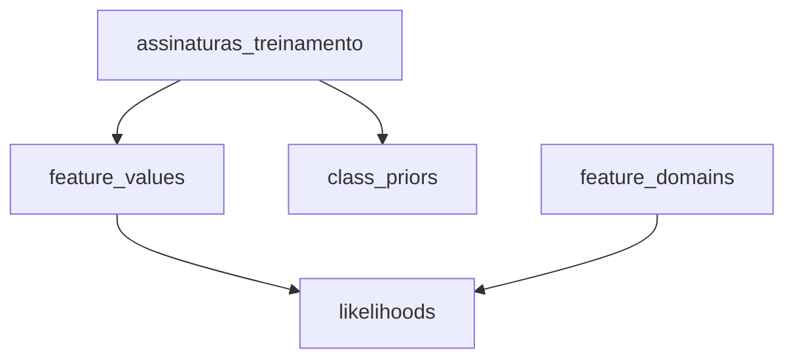

# Documentação SQL — Views

## Visão geral

Este documento descreve as views localizadas em:

```text
sql/views/
```

A estrutura atual é:

```text
sql/
└── views/
    ├── dominios_features.sql
    ├── valores_features.sql
    ├── probabilidades_priori.sql
    └── verossimilhancas.sql
```

As views representam as etapas intermediárias do treinamento estatístico do Naive Bayes.

O fluxo principal é:



---

# `dominios_features.sql`

## Objetivo

A view `feature_domains` registra todas as categorias possíveis de cada feature.

Ela é necessária principalmente para a suavização de Laplace.

```sql
-- Catálogo dos valores aceitos por cada feature categórica.
-- O total de categorias de cada feature é usado como K na suavização de Laplace.
CREATE OR REPLACE VIEW feature_domains (feature, valor) AS

VALUES
    ('plano_assinatura', 'Basico'),
    ('plano_assinatura', 'Intermediario'),
    ('plano_assinatura', 'Premium'),
    ('frequencia_uso', 'Baixa'),
    ('frequencia_uso', 'Media'),
    ('frequencia_uso', 'Alta'),
    ('tempo_desde_ultimo_acesso', 'Recente'),
    ('tempo_desde_ultimo_acesso', 'Moderado'),
    ('tempo_desde_ultimo_acesso', 'Longo'),
    ('uso_beneficios_plano', 'Baixo'),
    ('uso_beneficios_plano', 'Medio'),
    ('uso_beneficios_plano', 'Alto'),
    ('variacao_preco', 'Manteve'),
    ('variacao_preco', 'Aumentou'),
    ('variacao_preco', 'Diminuiu'),
    ('percepcao_custo_beneficio', 'Baixa'),
    ('percepcao_custo_beneficio', 'Media'),
    ('percepcao_custo_beneficio', 'Alta'),
    ('nivel_satisfacao', 'Baixo'),
    ('nivel_satisfacao', 'Medio'),
    ('nivel_satisfacao', 'Alto'),
    ('falhas_pagamento', 'Nenhuma'),
    ('falhas_pagamento', 'Ocasional'),
    ('falhas_pagamento', 'Recorrente');
```

## Estrutura gerada

A view possui duas colunas:

```text
feature
valor
```

Exemplo:

```text
feature                         valor
------------------------------  ----------------------
plano_assinatura          Basico
plano_assinatura          Intermediario
plano_assinatura          Premium
frequencia_uso            Baixa
frequencia_uso            Media
frequencia_uso            Alta
...
```

## Por que essa view existe?

O Naive Bayes precisa conhecer quantas categorias possíveis existem para cada feature.

Por exemplo:

```text
plano_assinatura
```

possui:

```text
Basico
Intermediario
Premium
```

Logo:

$$
K = 3
$$

Esse valor é usado na suavização de Laplace:

$$
P(X=v \mid C) = \frac{\text{contagem} + 1}{N(C) + K}
$$

## Uso de `VALUES`

O trecho:

```sql
VALUES
    ('plano_assinatura', 'Basico'),
    ('plano_assinatura', 'Intermediario'),
    ('plano_assinatura', 'Premium')
```

cria linhas diretamente dentro da consulta.

As colunas `feature` e `valor` são declaradas diretamente na definição da view:

```sql
CREATE OR REPLACE VIEW feature_domains (feature, valor) AS
VALUES (...);
```

---

# `valores_features.sql`

## Objetivo

Esta view transforma os registros da tabela `assinaturas_treinamento` de um formato baseado em colunas para um formato baseado em pares:

```text
feature → valor
```

```sql
-- Converte as oito colunas de features em linhas no formato
-- (id, classe, feature, valor). Assim, as views de contagem podem
-- contar qualquer valor dentro de cada classe de forma uniforme.
CREATE OR REPLACE VIEW feature_values AS

SELECT
    s.id,
    s.cancelou_assinatura AS classe,
    f.feature,
    f.valor

FROM assinaturas_treinamento s

CROSS JOIN LATERAL (
    VALUES
        ('plano_assinatura', s.plano_assinatura),
        ('frequencia_uso', s.frequencia_uso),
        ('tempo_desde_ultimo_acesso', s.tempo_desde_ultimo_acesso),
        ('uso_beneficios_plano', s.uso_beneficios_plano),
        ('variacao_preco', s.variacao_preco),
        ('percepcao_custo_beneficio', s.percepcao_custo_beneficio),
        ('nivel_satisfacao', s.nivel_satisfacao),
        ('falhas_pagamento', s.falhas_pagamento)

) AS f(feature, valor);
```

## Exemplo da transformação

Um registro original pode ser:

```text
id = 1
plano_assinatura = Basico
frequencia_uso = Baixa
tempo_desde_ultimo_acesso = Longo
uso_beneficios_plano = Baixo
variacao_preco = Aumentou
percepcao_custo_beneficio = Baixa
nivel_satisfacao = Baixo
falhas_pagamento = Recorrente
cancelou_assinatura = Sim
```

A view gera:

```text
id  classe  feature                       valor
--  ------  ----------------------------  ---------
1   Sim     plano_assinatura              Basico
1   Sim     frequencia_uso                Baixa
1   Sim     tempo_desde_ultimo_acesso     Longo
1   Sim     uso_beneficios_plano          Baixo
1   Sim     variacao_preco                Aumentou
1   Sim     percepcao_custo_beneficio     Baixa
1   Sim     nivel_satisfacao              Baixo
1   Sim     falhas_pagamento              Recorrente
```

## Por que isso é útil?

O Naive Bayes precisa responder perguntas como:

```text
Quantas vezes plano_assinatura = Basico
apareceu na classe Sim?
```

ou:

```text
Quantas vezes uso_beneficios_plano = Baixo
apareceu na classe Nao?
```

Com todas as features representadas pelas colunas:

```text
classe
feature
valor
```

as contagens podem ser feitas de forma uniforme.

## `CROSS JOIN LATERAL`

```sql
CROSS JOIN LATERAL (
    VALUES
        ...
) AS f(feature, valor)
```

O `LATERAL` permite que o bloco interno utilize as colunas do registro atual da tabela, como:

```sql
s.plano_assinatura
s.frequencia_uso
```

Cada registro da tabela gera oito linhas na view.

---

# `probabilidades_priori.sql`

## Objetivo

Esta view calcula as probabilidades a priori das classes:

$$
P(C)
$$

```sql
-- Probabilidade a priori de cada classe, antes de observar as features.
-- Fórmula: P(classe) = quantidade_da_classe / quantidade_total.
CREATE OR REPLACE VIEW class_priors AS

SELECT
    cancelou_assinatura AS classe,
    COUNT(*) AS quantidade,

    -- P(classe) = quantidade_da_classe / quantidade_total.
    COUNT(*)::NUMERIC / (SELECT COUNT(*) FROM assinaturas_treinamento) AS probabilidade

FROM assinaturas_treinamento

GROUP BY cancelou_assinatura;
```

## Fórmula

$$
P(C) = \frac{N(C)}{N}
$$

No conjunto de 5.000 registros:

```text
Sim = 2.099
Nao = 2.901
```

Logo:

$$
\begin{aligned}
P(\text{Sim}) &= \frac{2099}{5000} = 0.4198 \\
P(\text{Nao}) &= \frac{2901}{5000} = 0.5802
\end{aligned}
$$

## Subconsulta do total de registros

```sql
(SELECT COUNT(*) FROM assinaturas_treinamento)
```

Calcula o total de registros do conjunto de treinamento para ser usado como divisor.

## Contagem por classe

```sql
SELECT
    cancelou_assinatura AS classe,
    COUNT(*) AS quantidade
FROM assinaturas_treinamento
GROUP BY cancelou_assinatura
```

Essa etapa separa os registros por classe e conta quantos pertencem a cada uma. O `GROUP BY cancelou_assinatura` faz o PostgreSQL produzir uma linha para `Sim` e outra para `Nao`.

## Fórmula na consulta

```sql
COUNT(*)::NUMERIC / (SELECT COUNT(*) FROM assinaturas_treinamento) AS probabilidade
```

Essa divisão mostra diretamente a fórmula da probabilidade a priori:

$$
P(C) = \frac{\text{quantidade da classe}}{\text{quantidade total de registros}}
$$

A subconsulta entre parênteses calcula o total de registros diretamente, sem precisar de um `CROSS JOIN`.

## Conversão para `NUMERIC`

```sql
COUNT(*)::NUMERIC
```

Converte a quantidade da classe para `NUMERIC`, garantindo uma divisão decimal na expressão de probabilidade.

---

# `verossimilhancas.sql`

## Objetivo

Esta view calcula as verossimilhanças:

$$
P(\text{feature} = \text{valor} \mid \text{classe})
$$

e aplica suavização de Laplace.

```sql
-- Verossimilidade de cada valor de feature dentro de cada classe.
-- Fórmula de Laplace: P(feature = valor | classe) =
-- (ocorrencias + 1) / (quantidade_da_classe + numero_de_categorias).
-- O CROSS JOIN com feature_domains também cria linhas para valores
-- que ainda não apareceram nos dados, permitindo aplicar o +1.
CREATE OR REPLACE VIEW likelihoods AS

WITH

-- Cada CTE calcula uma parte necessária da fórmula de Laplace.
contagem_classe AS (
    -- Quantidade de registros em cada classe: Sim e Nao.
    SELECT
        cancelou_assinatura AS classe,
        COUNT(*) AS quantidade

    FROM assinaturas_treinamento

    GROUP BY cancelou_assinatura
),

cardinalidade AS (
    -- K: número de categorias disponíveis para cada feature.
    SELECT
        feature,
        COUNT(*) AS quantidade_categorias

    FROM feature_domains

    GROUP BY feature
),

contagem_valores AS (
    -- Quantidade observada de cada combinação classe, feature e valor.
    SELECT
        classe,
        feature,
        valor,
        COUNT(*) AS quantidade

    FROM feature_values

    GROUP BY
        classe,
        feature,
        valor
)

SELECT
    -- Classe para a qual a probabilidade será calculada.
    contagem_classe.classe,

    -- Nome da feature, como plano_assinatura.
    feature_domains.feature,

    -- Categoria da feature, como Alta ou Baixa.
    feature_domains.valor,

    -- Quantas vezes o valor apareceu dentro da classe.
    -- Se não apareceu, COALESCE transforma NULL em zero.
    COALESCE(contagem_valores.quantidade, 0) AS quantidade_observada,

    -- Quantidade total de registros da classe.
    contagem_classe.quantidade
        AS quantidade_classe,

    -- K: quantidade de categorias possíveis para a feature.
    cardinalidade.quantidade_categorias,

    -- Aplicação da suavização de Laplace:
    -- (ocorrencias + 1) / (quantidade_da_classe + K).
    (COALESCE(contagem_valores.quantidade, 0) + 1)::NUMERIC / (contagem_classe.quantidade + cardinalidade.quantidade_categorias)
    AS probabilidade

-- Começa com uma linha para cada classe existente.
FROM contagem_classe

-- Combina cada classe com todas as features e categorias permitidas.
-- Isso inclui categorias que ainda não apareceram nos dados.
CROSS JOIN feature_domains

-- Adiciona o número de categorias da feature, usado como K.
JOIN cardinalidade
    ON cardinalidade.feature = feature_domains.feature

-- Procura a quantidade observada para a combinação atual.
-- LEFT JOIN mantém a linha mesmo quando essa combinação não existe.
LEFT JOIN contagem_valores
    ON contagem_valores.classe = contagem_classe.classe
    AND contagem_valores.feature = feature_domains.feature
    AND contagem_valores.valor = feature_domains.valor;
```

## CTE `contagem_classe`

Calcula quantos registros existem em cada classe.

```sql
SELECT
    cancelou_assinatura AS classe,
    COUNT(*) AS quantidade
FROM assinaturas_treinamento
GROUP BY cancelou_assinatura
```

Exemplo:

```text
classe  quantidade
------  ----------
Sim     2099
Nao     2901
```

---

## CTE `cardinalidade`

```sql
SELECT
    feature,
    COUNT(*) AS quantidade_categorias
FROM feature_domains
GROUP BY feature
```

Conta quantos valores possíveis cada feature possui.

Esse valor corresponde ao `K` utilizado na suavização de Laplace.

---

## CTE `contagem_valores`

```sql
SELECT
    classe,
    feature,
    valor,
    COUNT(*) AS quantidade
FROM feature_values
GROUP BY
    classe,
    feature,
    valor
```

Conta quantas vezes cada valor aparece dentro de cada classe.

Exemplo conceitual:

```text
classe  feature                   valor  quantidade
------  ------------------------  -----  ----------
Sim     plano_assinatura    Basico   1203
Nao     plano_assinatura    Basico    990
```

---

## `CROSS JOIN feature_domains`

```sql
CROSS JOIN feature_domains
```

Como `contagem_classe` já possui uma linha para cada classe, essa operação gera todas as combinações possíveis entre:

- classe;
- feature;
- valor.

Isso garante que uma categoria continue existindo no cálculo mesmo quando sua contagem observada for zero.

---

## `LEFT JOIN` das contagens

```sql
LEFT JOIN contagem_valores
    ON contagem_valores.classe = contagem_classe.classe
    AND contagem_valores.feature = feature_domains.feature
    AND contagem_valores.valor = feature_domains.valor
```

Mantém a combinação mesmo quando não existe ocorrência correspondente em `contagem_valores`.

---

## `COALESCE`

```sql
COALESCE(contagem_valores.quantidade, 0)
```

Transforma valores `NULL` em zero.

Isso permite aplicar a suavização de Laplace corretamente a categorias nunca observadas.

---

## Suavização de Laplace

A expressão:

```sql
(COALESCE(contagem_valores.quantidade, 0) + 1)::NUMERIC
    / (contagem_classe.quantidade + cardinalidade.quantidade_categorias)
```

implementa:

$$
P(X=v \mid C) = \frac{N(X=v, C) + 1}{N(C) + K}
$$

Onde:

- `N(X=v, C)` é a quantidade de ocorrências do valor na classe;
- `N(C)` é a quantidade de registros da classe;
- `K` é a quantidade de categorias possíveis da feature.

## Por que usar Laplace?

Sem suavização, uma combinação não observada produziria:

$$
P(X=v \mid C) = 0
$$

Como o Naive Bayes combina várias probabilidades, uma única probabilidade zero poderia eliminar completamente o score de uma classe.

Laplace evita esse problema.

---

# Consultas úteis

## Domínios

```sql
SELECT *
FROM feature_domains
ORDER BY feature, valor;
```

## Valores das features

```sql
SELECT *
FROM feature_values
ORDER BY id, feature;
```

## Probabilidades a priori

```sql
SELECT *
FROM class_priors;
```

## Verossimilhanças

```sql
SELECT *
FROM likelihoods
ORDER BY classe, feature, valor;
```

---

# Resumo das views

| View | Responsabilidade |
|---|---|
| `feature_domains` | registrar as categorias possíveis de cada feature |
| `feature_values` | transformar os registros em pares feature/valor |
| `class_priors` | calcular `P(classe)` |
| `likelihoods` | calcular `P(feature = valor | classe)` com Laplace |
