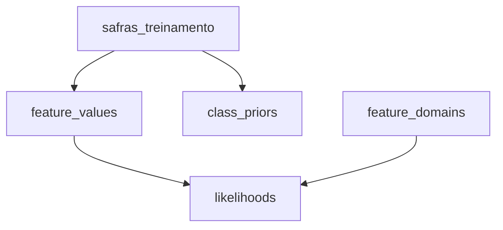

# Documentação SQL — Views

## Visão geral

Este documento descreve as views localizadas em:

```text
sql/views/
```

A estrutura atual é:

```text
sql/
└── views/
    ├── dominios_features.sql
    ├── valores_features.sql
    ├── probabilidades_priori.sql
    └── verossimilhancas.sql
```

As views representam as etapas intermediárias do treinamento estatístico do Naive Bayes.

O fluxo principal é:



---

# `dominios_features.sql`

## Objetivo

A view `feature_domains` registra todas as categorias possíveis de cada feature.

Ela é necessária principalmente para a suavização de Laplace.

```sql
CREATE OR REPLACE VIEW feature_domains AS

SELECT *
FROM (
    VALUES
        ('produtividade_estimada', 'Baixa'),
        ('produtividade_estimada', 'Média'),
        ('produtividade_estimada', 'Alta'),

        ('preco_esperado_venda', 'Baixo'),
        ('preco_esperado_venda', 'Normal'),
        ('preco_esperado_venda', 'Alto'),

        ('custo_total_producao', 'Baixo'),
        ('custo_total_producao', 'Médio'),
        ('custo_total_producao', 'Alto'),

        ('precipitacao_acumulada', 'Insuficiente'),
        ('precipitacao_acumulada', 'Adequada'),
        ('precipitacao_acumulada', 'Excessiva'),

        ('temperatura_media', 'Abaixo da faixa ideal'),
        ('temperatura_media', 'Adequada'),
        ('temperatura_media', 'Acima da faixa ideal'),

        ('incidencia_pragas_doencas', 'Baixa'),
        ('incidencia_pragas_doencas', 'Moderada'),
        ('incidencia_pragas_doencas', 'Alta'),

        ('custo_insumos_agricolas', 'Baixo'),
        ('custo_insumos_agricolas', 'Normal'),
        ('custo_insumos_agricolas', 'Alto'),

        ('historico_produtividade', 'Baixo'),
        ('historico_produtividade', 'Médio'),
        ('historico_produtividade', 'Alto')

) AS dominio(feature, valor);
```

## Estrutura gerada

A view possui duas colunas:

```text
feature
valor
```

Exemplo:

```text
feature                         valor
------------------------------  ----------------------
produtividade_estimada          Baixa
produtividade_estimada          Média
produtividade_estimada          Alta
preco_esperado_venda            Baixo
preco_esperado_venda            Normal
preco_esperado_venda            Alto
...
```

## Por que essa view existe?

O Naive Bayes precisa conhecer quantas categorias possíveis existem para cada feature.

Por exemplo:

```text
produtividade_estimada
```

possui:

```text
Baixa
Média
Alta
```

Logo:

$$
K = 3
$$

Esse valor é usado na suavização de Laplace:

$$
P(X=v \mid C) = \frac{\text{contagem} + 1}{N(C) + K}
$$

## Uso de `VALUES`

O trecho:

```sql
VALUES
    ('produtividade_estimada', 'Baixa'),
    ('produtividade_estimada', 'Média'),
    ('produtividade_estimada', 'Alta')
```

cria linhas diretamente dentro da consulta.

Depois:

```sql
AS dominio(feature, valor)
```

define o nome das colunas resultantes.

---

# `valores_features.sql`

## Objetivo

Esta view transforma os registros da tabela `safras_treinamento` de um formato baseado em colunas para um formato baseado em pares:

```text
feature → valor
```

```sql
CREATE OR REPLACE VIEW feature_values AS

SELECT
    s.id,
    s.rentavel AS classe,
    f.feature,
    f.valor

FROM safras_treinamento s

CROSS JOIN LATERAL (
    VALUES
        ('produtividade_estimada', s.produtividade_estimada),
        ('preco_esperado_venda', s.preco_esperado_venda),
        ('custo_total_producao', s.custo_total_producao),
        ('precipitacao_acumulada', s.precipitacao_acumulada),
        ('temperatura_media', s.temperatura_media),
        ('incidencia_pragas_doencas', s.incidencia_pragas_doencas),
        ('custo_insumos_agricolas', s.custo_insumos_agricolas),
        ('historico_produtividade', s.historico_produtividade)

) AS f(feature, valor);
```

## Exemplo da transformação

Um registro original pode ser:

```text
id = 1
produtividade_estimada = Alta
preco_esperado_venda = Alto
custo_total_producao = Médio
precipitacao_acumulada = Adequada
temperatura_media = Adequada
incidencia_pragas_doencas = Baixa
custo_insumos_agricolas = Normal
historico_produtividade = Alto
rentavel = Sim
```

A view gera:

```text
id  classe  feature                       valor
--  ------  ----------------------------  ---------
1   Sim     produtividade_estimada        Alta
1   Sim     preco_esperado_venda          Alto
1   Sim     custo_total_producao          Médio
1   Sim     precipitacao_acumulada        Adequada
1   Sim     temperatura_media             Adequada
1   Sim     incidencia_pragas_doencas     Baixa
1   Sim     custo_insumos_agricolas       Normal
1   Sim     historico_produtividade       Alto
```

## Por que isso é útil?

O Naive Bayes precisa responder perguntas como:

```text
Quantas vezes produtividade_estimada = Alta
apareceu na classe Sim?
```

ou:

```text
Quantas vezes precipitacao_acumulada = Insuficiente
apareceu na classe Nao?
```

Com todas as features representadas pelas colunas:

```text
classe
feature
valor
```

as contagens podem ser feitas de forma uniforme.

## `CROSS JOIN LATERAL`

```sql
CROSS JOIN LATERAL (
    VALUES
        ...
) AS f(feature, valor)
```

O `LATERAL` permite que o bloco interno utilize as colunas do registro atual da tabela, como:

```sql
s.produtividade_estimada
s.preco_esperado_venda
```

Cada registro da tabela gera oito linhas na view.

---

# `probabilidades_priori.sql`

## Objetivo

Esta view calcula as probabilidades a priori das classes:

$$
P(C)
$$

```sql
CREATE OR REPLACE VIEW class_priors AS

WITH total_registros AS (
    -- Conta todos os registros usados no treinamento.
    SELECT
        COUNT(*) AS total
    FROM safras_treinamento
),

quantidade_por_classe AS (
    -- Conta quantos registros pertencem a cada classe.
    SELECT
        rentavel AS classe,
        COUNT(*) AS quantidade
    FROM safras_treinamento
    GROUP BY rentavel
)

SELECT
    quantidade_por_classe.classe,
    quantidade_por_classe.quantidade,

    -- P(classe) = quantidade_da_classe / quantidade_total.
    quantidade_por_classe.quantidade::NUMERIC / total_registros.total
        AS probabilidade

FROM quantidade_por_classe

CROSS JOIN total_registros;
```

## Fórmula

$$
P(C) = \frac{N(C)}{N}
$$

No conjunto de 120 registros balanceados:

```text
Sim = 60
Nao = 60
```

Logo:

$$
\begin{aligned}
P(\text{Sim}) &= \frac{60}{120} = 0.5 \\
P(\text{Nao}) &= \frac{60}{120} = 0.5
\end{aligned}
$$

## CTE `total_registros`

```sql
WITH total_registros AS (
    -- Conta todos os registros usados no treinamento.
    SELECT
        COUNT(*) AS total
    FROM safras_treinamento
)
```

Calcula o total de registros do conjunto de treinamento e chama esse resultado de `total`.

## CTE `quantidade_por_classe`

```sql
quantidade_por_classe AS (
    SELECT
        rentavel AS classe,
        COUNT(*) AS quantidade
    FROM safras_treinamento
    GROUP BY rentavel
)
```

Essa etapa separa os registros por classe e conta quantos pertencem a cada uma. O `GROUP BY rentavel` faz o PostgreSQL produzir uma linha para `Sim` e outra para `Nao`.

## Fórmula na consulta

```sql
quantidade_por_classe.quantidade::NUMERIC / total_registros.total
    AS probabilidade
```

Essa divisão mostra diretamente a fórmula da probabilidade a priori:

$$
P(C) = \frac{\text{quantidade da classe}}{\text{quantidade total de registros}}
$$

O `CROSS JOIN` apenas coloca o mesmo total de registros ao lado de cada classe, para que a divisão possa ser feita.

## Conversão para `NUMERIC`

```sql
quantidade_por_classe.quantidade::NUMERIC
```

Converte a quantidade da classe para `NUMERIC`, garantindo uma divisão decimal na expressão de probabilidade.

---

# `verossimilhancas.sql`

## Objetivo

Esta view calcula as verossimilhanças:

$$
P(\text{feature} = \text{valor} \mid \text{classe})
$$

e aplica suavização de Laplace.

```sql
CREATE OR REPLACE VIEW likelihoods AS

WITH

-- Cada CTE calcula uma parte necessária da fórmula de Laplace.
contagem_classe AS (
    SELECT
        rentavel AS classe,
        COUNT(*) AS quantidade

    FROM safras_treinamento

    GROUP BY rentavel
),

cardinalidade AS (
    SELECT
        feature,
        COUNT(*) AS quantidade_categorias

    FROM feature_domains

    GROUP BY feature
),

contagem_valores AS (
    -- Quantidade observada de cada combinação classe, feature e valor.
    SELECT
        classe,
        feature,
        valor,
        COUNT(*) AS quantidade

    FROM feature_values

    GROUP BY
        classe,
        feature,
        valor
)

SELECT
    -- Classe para a qual a probabilidade será calculada.
    contagem_classe.classe,

    -- Nome da feature, como produtividade_estimada.
    feature_domains.feature,

    -- Categoria da feature, como Alta ou Baixa.
    feature_domains.valor,

    -- Quantas vezes o valor apareceu dentro da classe.
    -- Se não apareceu, COALESCE transforma NULL em zero.
    COALESCE(contagem_valores.quantidade, 0) AS quantidade_observada,

    -- Quantidade total de registros da classe.
    contagem_classe.quantidade
        AS quantidade_classe,

    -- K: quantidade de categorias possíveis para a feature.
    cardinalidade.quantidade_categorias,

    -- Aplicação da suavização de Laplace:
    -- (ocorrencias + 1) / (quantidade_da_classe + K).
    (COALESCE(contagem_valores.quantidade, 0) + 1)::NUMERIC
        / (contagem_classe.quantidade + cardinalidade.quantidade_categorias)
        AS probabilidade

-- Começa com uma linha para cada classe existente.
FROM contagem_classe

-- Combina cada classe com todas as features e categorias permitidas.
-- Isso inclui categorias que ainda não apareceram nos dados.
CROSS JOIN feature_domains

-- Adiciona o número de categorias da feature, usado como K.
JOIN cardinalidade
    ON cardinalidade.feature = feature_domains.feature

-- Procura a quantidade observada para a combinação atual.
-- LEFT JOIN mantém a linha mesmo quando essa combinação não existe.
LEFT JOIN contagem_valores
    ON contagem_valores.classe = contagem_classe.classe
    AND contagem_valores.feature = feature_domains.feature
    AND contagem_valores.valor = feature_domains.valor;
```

## CTE `contagem_classe`

Calcula quantos registros existem em cada classe.

```sql
SELECT
    rentavel AS classe,
    COUNT(*) AS quantidade
FROM safras_treinamento
GROUP BY rentavel
```

Exemplo:

```text
classe  quantidade
------  ----------
Sim     60
Nao     60
```

---

## CTE `cardinalidade`

```sql
SELECT
    feature,
    COUNT(*) AS quantidade_categorias
FROM feature_domains
GROUP BY feature
```

Conta quantos valores possíveis cada feature possui.

Esse valor corresponde ao `K` utilizado na suavização de Laplace.

---

## CTE `contagem_valores`

```sql
SELECT
    classe,
    feature,
    valor,
    COUNT(*) AS quantidade
FROM feature_values
GROUP BY
    classe,
    feature,
    valor
```

Conta quantas vezes cada valor aparece dentro de cada classe.

Exemplo conceitual:

```text
classe  feature                   valor  quantidade
------  ------------------------  -----  ----------
Sim     produtividade_estimada    Alta   32
Nao     produtividade_estimada    Alta   19
```

---

## `CROSS JOIN feature_domains`

```sql
CROSS JOIN feature_domains
```

Como `contagem_classe` já possui uma linha para cada classe, essa operação gera todas as combinações possíveis entre:

- classe;
- feature;
- valor.

Isso garante que uma categoria continue existindo no cálculo mesmo quando sua contagem observada for zero.

---

## `LEFT JOIN` das contagens

```sql
LEFT JOIN contagem_valores
    ON contagem_valores.classe = contagem_classe.classe
    AND contagem_valores.feature = feature_domains.feature
    AND contagem_valores.valor = feature_domains.valor
```

Mantém a combinação mesmo quando não existe ocorrência correspondente em `contagem_valores`.

---

## `COALESCE`

```sql
COALESCE(contagem_valores.quantidade, 0)
```

Transforma valores `NULL` em zero.

Isso permite aplicar a suavização de Laplace corretamente a categorias nunca observadas.

---

## Suavização de Laplace

A expressão:

```sql
(COALESCE(contagem_valores.quantidade, 0) + 1)::NUMERIC
    / (contagem_classe.quantidade + cardinalidade.quantidade_categorias)
```

implementa:

$$
P(X=v \mid C) = \frac{N(X=v, C) + 1}{N(C) + K}
$$

Onde:

- `N(X=v, C)` é a quantidade de ocorrências do valor na classe;
- `N(C)` é a quantidade de registros da classe;
- `K` é a quantidade de categorias possíveis da feature.

## Por que usar Laplace?

Sem suavização, uma combinação não observada produziria:

$$
P(X=v \mid C) = 0
$$

Como o Naive Bayes combina várias probabilidades, uma única probabilidade zero poderia eliminar completamente o score de uma classe.

Laplace evita esse problema.

---

# Consultas úteis

## Domínios

```sql
SELECT *
FROM feature_domains
ORDER BY feature, valor;
```

## Valores das features

```sql
SELECT *
FROM feature_values
ORDER BY id, feature;
```

## Probabilidades a priori

```sql
SELECT *
FROM class_priors;
```

## Verossimilhanças

```sql
SELECT *
FROM likelihoods
ORDER BY classe, feature, valor;
```

---

# Resumo das views

| View | Responsabilidade |
|---|---|
| `feature_domains` | registrar as categorias possíveis de cada feature |
| `feature_values` | transformar os registros em pares feature/valor |
| `class_priors` | calcular `P(classe)` |
| `likelihoods` | calcular `P(feature = valor | classe)` com Laplace |
