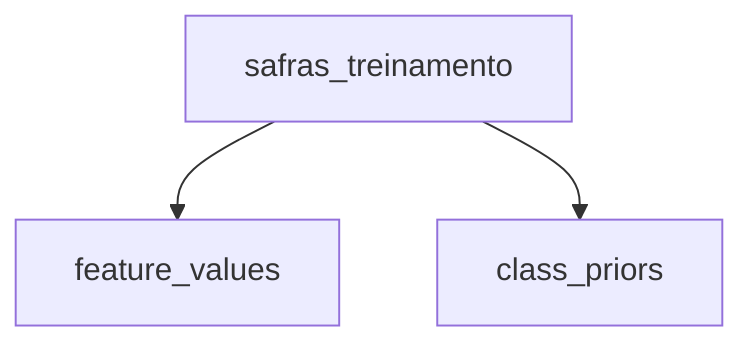

# Documentação SQL — Tables

## Visão geral

Este documento descreve os objetos SQL localizados em:

```text
sql/tables/
```

Atualmente, essa pasta contém:

```text
sql/
└── tables/
    └── safras_treinamento.sql
```

A tabela `safras_treinamento` é responsável por armazenar os registros utilizados no treinamento do classificador Naive Bayes.

---

# `safras_treinamento.sql`

## Objetivo

Este arquivo cria a tabela que armazena o conjunto de dados de treinamento utilizado para prever se uma safra será economicamente rentável.

```sql
CREATE TABLE IF NOT EXISTS safras_treinamento (
    id BIGINT GENERATED ALWAYS AS IDENTITY PRIMARY KEY,

    nome_safra VARCHAR(100) NOT NULL
        CHECK (BTRIM(nome_safra) <> ''),

    produtividade_estimada VARCHAR(20) NOT NULL
        CHECK (
            produtividade_estimada IN (
                'Baixa',
                'Média',
                'Alta'
            )
        ),

    preco_esperado_venda VARCHAR(20) NOT NULL
        CHECK (
            preco_esperado_venda IN (
                'Baixo',
                'Normal',
                'Alto'
            )
        ),

    custo_total_producao VARCHAR(20) NOT NULL
        CHECK (
            custo_total_producao IN (
                'Baixo',
                'Médio',
                'Alto'
            )
        ),

    precipitacao_acumulada VARCHAR(20) NOT NULL
        CHECK (
            precipitacao_acumulada IN (
                'Insuficiente',
                'Adequada',
                'Excessiva'
            )
        ),

    temperatura_media VARCHAR(30) NOT NULL
        CHECK (
            temperatura_media IN (
                'Abaixo da faixa ideal',
                'Adequada',
                'Acima da faixa ideal'
            )
        ),

    incidencia_pragas_doencas VARCHAR(20) NOT NULL
        CHECK (
            incidencia_pragas_doencas IN (
                'Baixa',
                'Moderada',
                'Alta'
            )
        ),

    custo_insumos_agricolas VARCHAR(20) NOT NULL
        CHECK (
            custo_insumos_agricolas IN (
                'Baixo',
                'Normal',
                'Alto'
            )
        ),

    historico_produtividade VARCHAR(20) NOT NULL
        CHECK (
            historico_produtividade IN (
                'Baixo',
                'Médio',
                'Alto'
            )
        ),

    rentavel VARCHAR(3) NOT NULL
        CHECK (
            rentavel IN ('Sim', 'Nao')
        )
);
```

## `CREATE TABLE IF NOT EXISTS`

```sql
CREATE TABLE IF NOT EXISTS safras_treinamento
```

Cria a tabela somente se ela ainda não existir.

Isso permite executar o arquivo novamente sem gerar erro apenas porque a tabela já está presente no banco.

---

## Coluna `id`

```sql
id BIGINT GENERATED ALWAYS AS IDENTITY PRIMARY KEY
```

É o identificador único de cada registro.

- `BIGINT`: permite uma grande quantidade de registros;
- `GENERATED ALWAYS AS IDENTITY`: o PostgreSQL gera o valor automaticamente;
- `PRIMARY KEY`: garante que cada registro possua um identificador único.

O campo `id` não participa do cálculo do Naive Bayes. Ele serve apenas para identificar os registros.

---

## Coluna `nome_safra`

```sql
nome_safra VARCHAR(100) NOT NULL
    CHECK (BTRIM(nome_safra) <> '')
```

Identifica a cultura de cada registro, mas é sintética e nunca entra no cálculo: não participa de `feature_domains`, `feature_values` ou `classificar_safra()`. O CSV usa o ciclo `Soja`, `Milho`, `Algodão`, `Arroz`, `Feijão` e `Sorgo`, com 20 registros por cultura e 10 por classe, porque não há mapeamento de origem por linha.

---

## Features categóricas

As oito features do modelo são armazenadas como texto porque os dados já foram discretizados antes de serem inseridos no banco.

As features são:

1. `produtividade_estimada`;
2. `preco_esperado_venda`;
3. `custo_total_producao`;
4. `precipitacao_acumulada`;
5. `temperatura_media`;
6. `incidencia_pragas_doencas`;
7. `custo_insumos_agricolas`;
8. `historico_produtividade`.

Por exemplo, em vez de armazenar produtividade como um valor contínuo:

```text
4.3 t/ha
5.7 t/ha
2.9 t/ha
```

o projeto utiliza categorias:

```text
Baixa
Média
Alta
```

---

## Constraints `CHECK`

Cada feature possui um `CHECK` restringindo quais categorias são aceitas.

Exemplo:

```sql
CHECK (
    produtividade_estimada IN (
        'Baixa',
        'Média',
        'Alta'
    )
)
```

Isso impede a inserção de valores que não pertencem ao domínio definido.

Por exemplo, seriam rejeitados valores como:

```text
Muito Alta
Excelente
Regular
```

Esse controle é importante porque o classificador trabalha exclusivamente com as categorias definidas no conjunto de dados.

---

## Coluna alvo `rentavel`

```sql
rentavel VARCHAR(3) NOT NULL
    CHECK (
        rentavel IN ('Sim', 'Nao')
    )
```

Essa coluna representa o rótulo alvo do problema de classificação binária.

As classes possíveis são:

```text
Sim → safra economicamente rentável
Nao → safra não rentável
```

Os registros dessa coluna são utilizados para calcular:

```text
P(Sim)
P(Nao)
```

e também as probabilidades condicionais das features dentro de cada classe.

---

## Papel da tabela no fluxo do Naive Bayes

A tabela é o ponto de origem dos dados usados pelas views do classificador:



A partir dela são calculados:

- os valores das features no formato feature/valor;
- a quantidade de registros por classe;
- as probabilidades a priori;
- as verossimilhanças utilizadas na classificação.

---

## Consulta de inspeção

Para visualizar os registros:

```sql
SELECT *
FROM safras_treinamento;
```

Para verificar a distribuição das classes:

```sql
SELECT
    rentavel,
    COUNT(*)
FROM safras_treinamento
GROUP BY rentavel;
```
