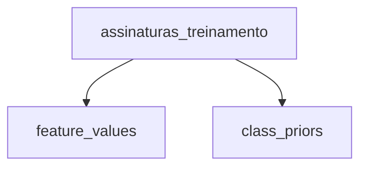

# Documentação SQL — Tables

## Visão geral

Este documento descreve os objetos SQL localizados em:

```text
sql/tables/
```

Atualmente, essa pasta contém:

```text
sql/
└── tables/
    └── assinaturas_treinamento.sql
```

A tabela `assinaturas_treinamento` é responsável por armazenar os registros utilizados no treinamento do classificador Naive Bayes.

---

# `assinaturas_treinamento.sql`

## Objetivo

Este arquivo cria a tabela que armazena o conjunto de dados de treinamento utilizado para prever se uma assinatura será cancelada.

```sql
-- Registros usados para prever cancelamento de assinatura.
CREATE TABLE IF NOT EXISTS assinaturas_treinamento (
    id BIGINT GENERATED ALWAYS AS IDENTITY PRIMARY KEY,
    plano_assinatura VARCHAR(20) NOT NULL CHECK (plano_assinatura IN ('Basico', 'Intermediario', 'Premium')),
    frequencia_uso VARCHAR(10) NOT NULL CHECK (frequencia_uso IN ('Baixa', 'Media', 'Alta')),
    tempo_desde_ultimo_acesso VARCHAR(10) NOT NULL CHECK (tempo_desde_ultimo_acesso IN ('Recente', 'Moderado', 'Longo')),
    uso_beneficios_plano VARCHAR(10) NOT NULL CHECK (uso_beneficios_plano IN ('Baixo', 'Medio', 'Alto')),
    variacao_preco VARCHAR(10) NOT NULL CHECK (variacao_preco IN ('Manteve', 'Aumentou', 'Diminuiu')),
    percepcao_custo_beneficio VARCHAR(10) NOT NULL CHECK (percepcao_custo_beneficio IN ('Baixa', 'Media', 'Alta')),
    nivel_satisfacao VARCHAR(10) NOT NULL CHECK (nivel_satisfacao IN ('Baixo', 'Medio', 'Alto')),
    falhas_pagamento VARCHAR(12) NOT NULL CHECK (falhas_pagamento IN ('Nenhuma', 'Ocasional', 'Recorrente')),
    cancelou_assinatura VARCHAR(3) NOT NULL CHECK (cancelou_assinatura IN ('Sim', 'Nao'))
);
```

## `CREATE TABLE IF NOT EXISTS`

```sql
CREATE TABLE IF NOT EXISTS assinaturas_treinamento
```

Cria a tabela somente se ela ainda não existir.

Isso permite executar o arquivo novamente sem gerar erro apenas porque a tabela já está presente no banco.

---

## Coluna `id`

```sql
id BIGINT GENERATED ALWAYS AS IDENTITY PRIMARY KEY
```

É o identificador único de cada registro.

- `BIGINT`: permite uma grande quantidade de registros;
- `GENERATED ALWAYS AS IDENTITY`: o PostgreSQL gera o valor automaticamente;
- `PRIMARY KEY`: garante que cada registro possua um identificador único.

O campo `id` não participa do cálculo do Naive Bayes. Ele serve apenas para identificar os registros.

---

## Identificador

A tabela gera `id` internamente e o CSV não possui identificador externo. O identificador não participa de `feature_domains`, `feature_values` nem de `classificar_cancelamento()`.

---

## Features categóricas

As oito features do modelo são armazenadas como texto porque os dados já foram discretizados antes de serem inseridos no banco.

As features são:

1. `plano_assinatura`;
2. `frequencia_uso`;
3. `tempo_desde_ultimo_acesso`;
4. `uso_beneficios_plano`;
5. `variacao_preco`;
6. `percepcao_custo_beneficio`;
7. `nivel_satisfacao`;
8. `falhas_pagamento`.

Por exemplo, em vez de armazenar a frequência de uso como um valor contínuo:

```text
1 acesso por mês
7 acessos por mês
20 acessos por mês
```

o projeto utiliza categorias:

```text
Baixa
Media
Alta
```

---

## Constraints `CHECK`

Cada feature possui um `CHECK` restringindo quais categorias são aceitas.

Exemplo:

```sql
CHECK (
    plano_assinatura IN (
        'Basico',
        'Intermediario',
        'Premium'
    )
)
```

Isso impede a inserção de valores que não pertencem ao domínio definido.

Por exemplo, seriam rejeitados valores como:

```text
Corporativo
Gratuito
Ilimitado
```

Esse controle é importante porque o classificador trabalha exclusivamente com as categorias definidas no conjunto de dados.

---

## Coluna alvo `cancelou_assinatura`

```sql
cancelou_assinatura VARCHAR(3) NOT NULL
    CHECK (
        cancelou_assinatura IN ('Sim', 'Nao')
    )
```

Essa coluna representa o rótulo alvo do problema de classificação binária.

As classes possíveis são:

```text
Sim → assinatura cancelada
Nao → assinatura permaneceu ativa
```

Os registros dessa coluna são utilizados para calcular:

```text
P(Sim)
P(Nao)
```

e também as probabilidades condicionais das features dentro de cada classe.

---

## Papel da tabela no fluxo do Naive Bayes

A tabela é o ponto de origem dos dados usados pelas views do classificador:



A partir dela são calculados:

- os valores das features no formato feature/valor;
- a quantidade de registros por classe;
- as probabilidades a priori;
- as verossimilhanças utilizadas na classificação.

---

## Consulta de inspeção

Para visualizar os registros:

```sql
SELECT *
FROM assinaturas_treinamento;
```

Para verificar a distribuição das classes:

```sql
SELECT
    cancelou_assinatura,
    COUNT(*)
FROM assinaturas_treinamento
GROUP BY cancelou_assinatura;
```
